# Ubuntu的安装部署（VirtualBox虚拟机安装Ubuntu22.04LTS）

由于Vmare在近期可能下载不到（2024/05/16），所以我选择使用VirtualBox来安装Ubuntu22.04LTS。VirtualBox是一个开源程序，可以在Windows、Linux、MacOS等操作系统上运行虚拟机。在这里我将介绍如何在Windows上安装VirtualBox，并在VirtualBox上安装Ubuntu22.04LTS。

## 前期准备（安装VirtualBox、准备Ubuntu镜像文件）

### 1. 安装VirtualBox

前往[VirtualBox官网](https://www.virtualbox.org/)下载安装VirtualBox

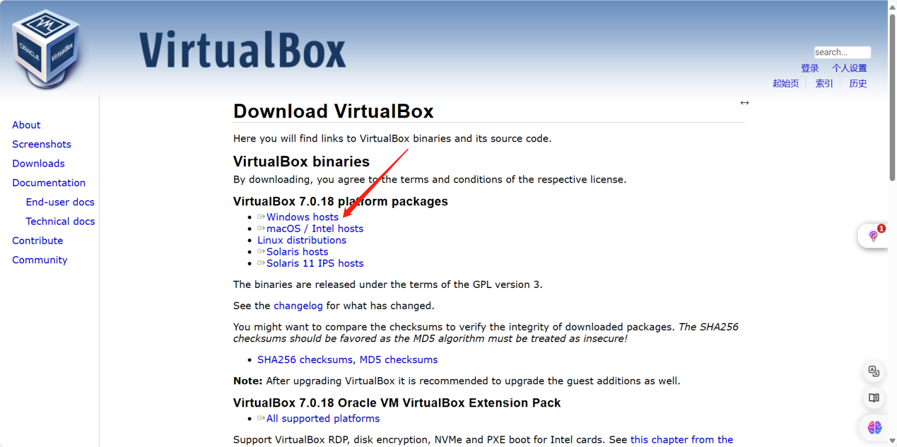

可以根据自己的进行修改安装路径，我将其安装在D盘下面

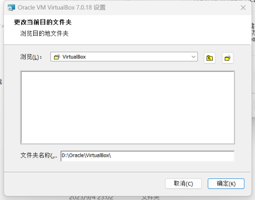

可能会提示需要安装依赖软件，点击是即可，等待安装完成即可

### 2. 准备Ubuntu镜像文件

我们可以选择前往在中国的镜像站点下载Ubuntu22.04LTS的镜像文件，这里我选择清华大学的镜像站点进行下载

[清华大学开源软件镜像站](https://mirrors.tuna.tsinghua.edu.cn/) -> [Ubuntu 24.04镜像](https://mirrors.tuna.tsinghua.edu.cn/ubuntu-releases/22.04/)

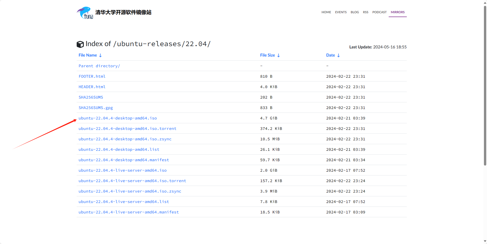

当然也可在首页如图所示进行下载

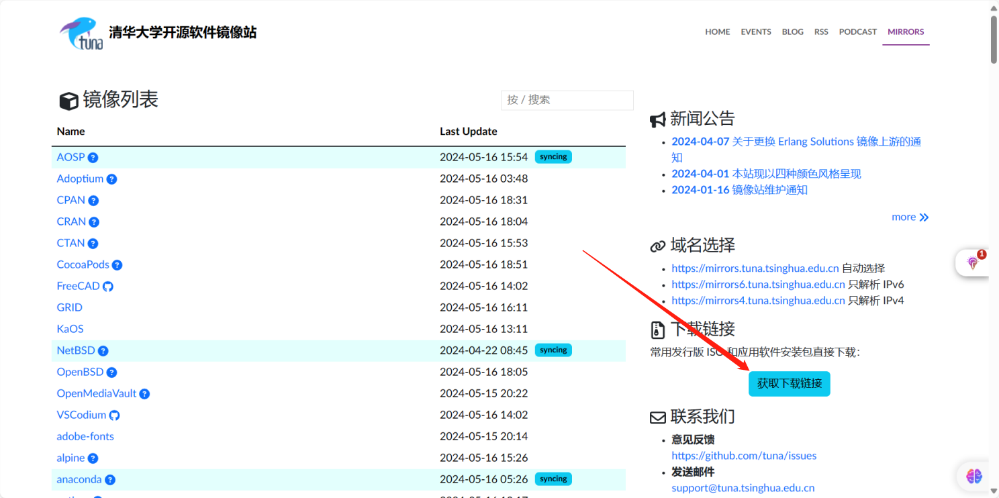
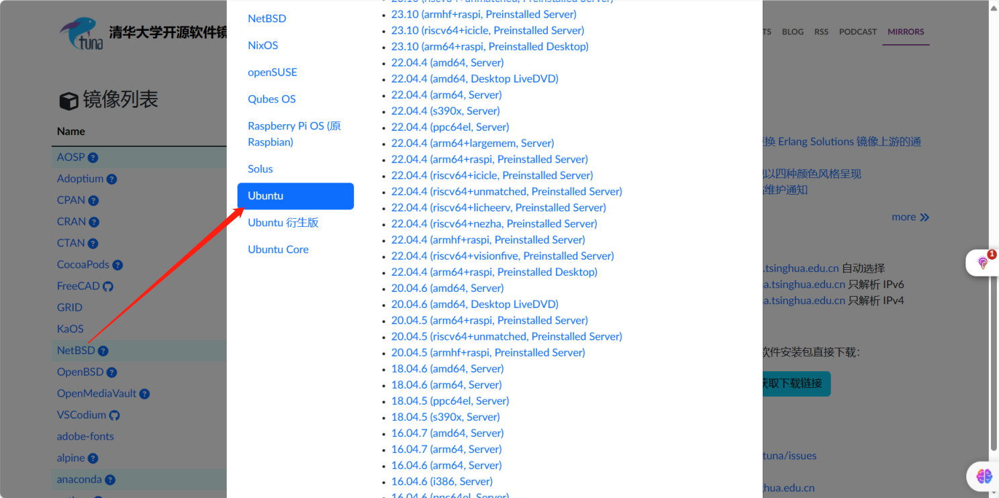
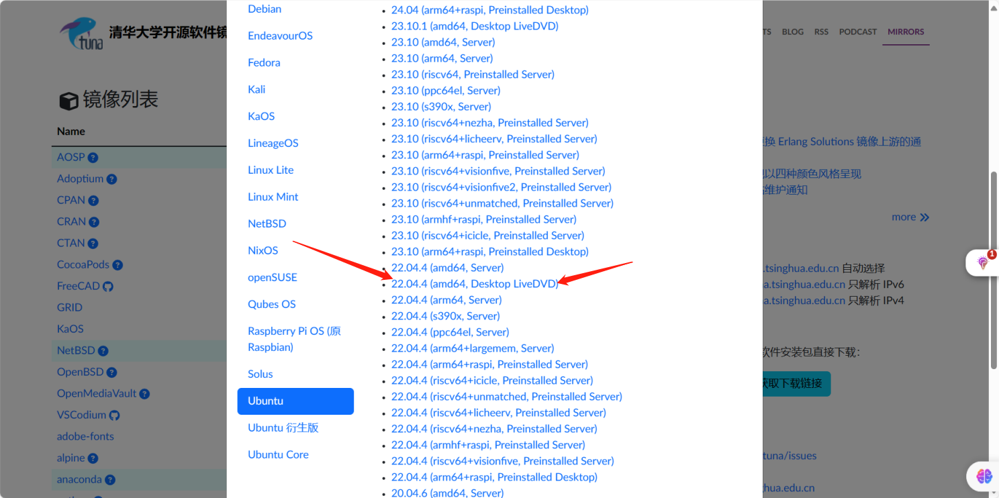

我们选的是`desktop-amd64`文件，点击下载即可，因为我们要学习使用Ubuntu，在前期使用的时候我们还是选则带有桌面的版本，下载完成之后我们就可以开始安装了

## 安装Ubuntu22.04LTS

### 1. 创建虚拟机

在VirtualBox中点击`新建`，输入虚拟机的名称、类型、版本、内存大小等信息，这里我选择的是`Ubuntu 64位`，内存大小选择

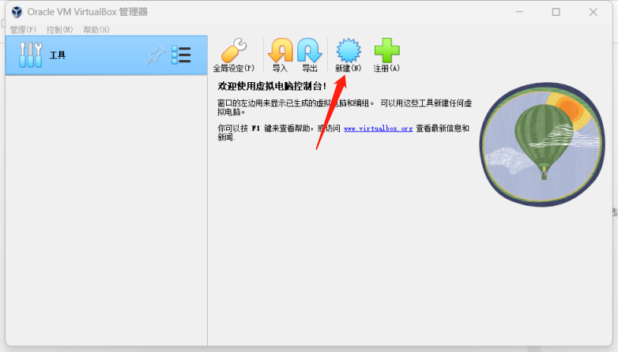

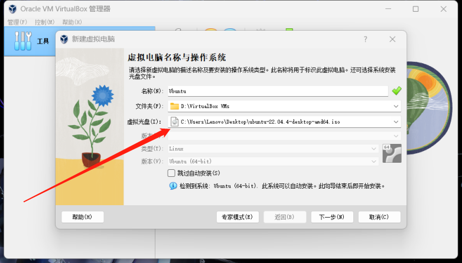

我们在这里选择手动安装（点选跳过自动安装），而非自动安装，如果您觉得以下教程麻烦，可以直接选择自动安装，但是我建议您选择手动安装，因为这样可以设置中文，避免一些奇奇怪怪的小问题，这样您可以更好的了解Ubuntu的安装过程。

硬件上我们选择4096MB的内存，处理器选择8个，我这里只是演示，请根据自己需要，选择合适的配置，我更推荐的是内存选择4GB，处理器选择4个，这样可以更好的运行Ubuntu

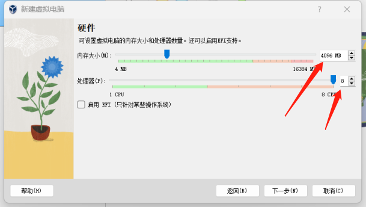

接着就到了创建虚拟硬盘的步骤，我们选择`现在创建虚拟硬盘`，磁盘空间选择20GB以上，可以不勾选`预先分配全部空间`。

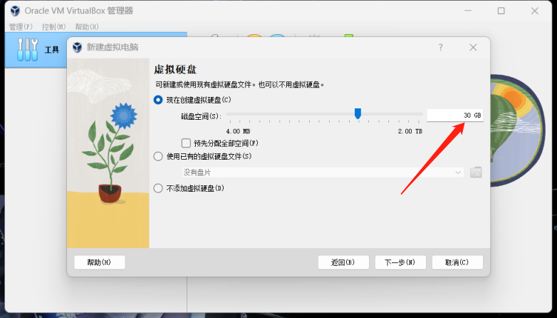

如果您的磁盘空间充足或者有想把他用Ventoy制作成Linux to go的想法，建议勾选`预先分配全部空间`。

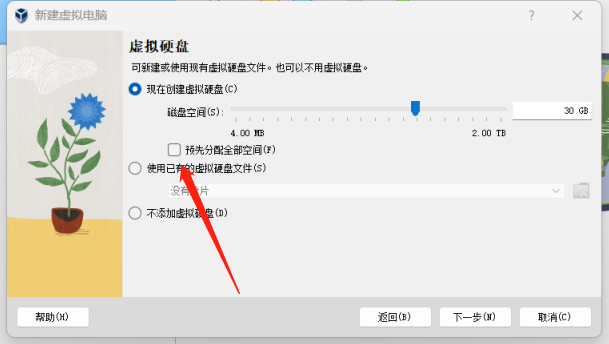

### 2. 安装Ubuntu

点击启动， 开始安装。

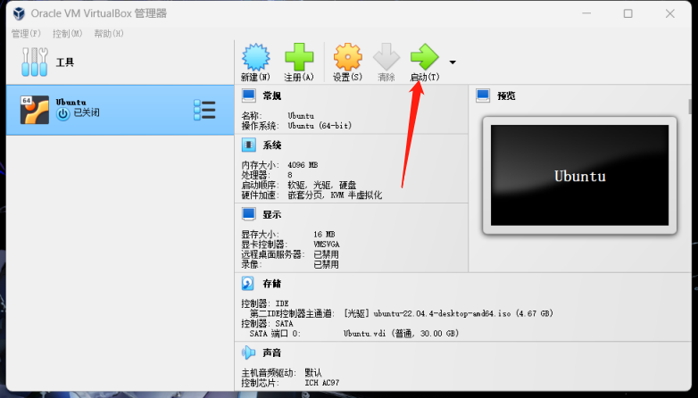

我们用`Enter`（回车）建选择`Try or Install Ubuntu`，进入安装界面

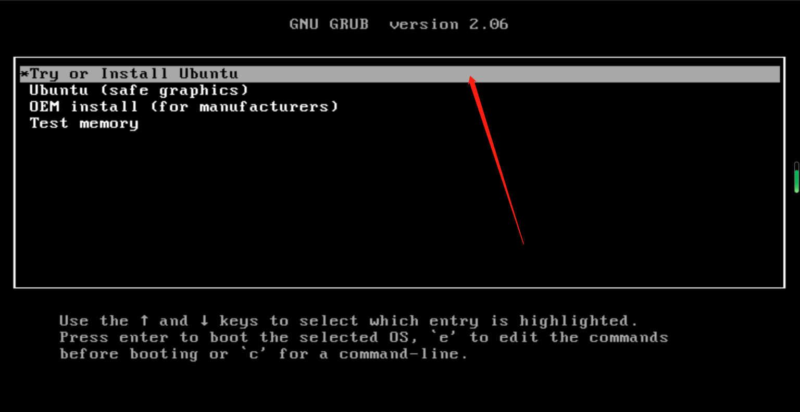

进入之后可以选择语言，我选择的是`简体中文`，选择`安装Ubuntu`

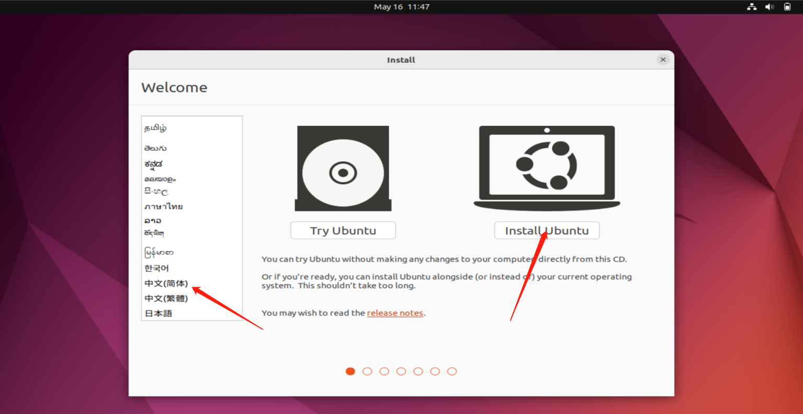

键盘布局，可以默认

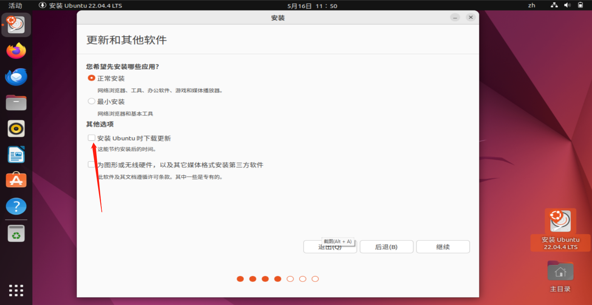

为了节约安装时间，我们取消勾选`安装Ubuntu时下载更新`

接下来就可以点击现在安装，遇到分区表的时候，选择继续，默认安装即可

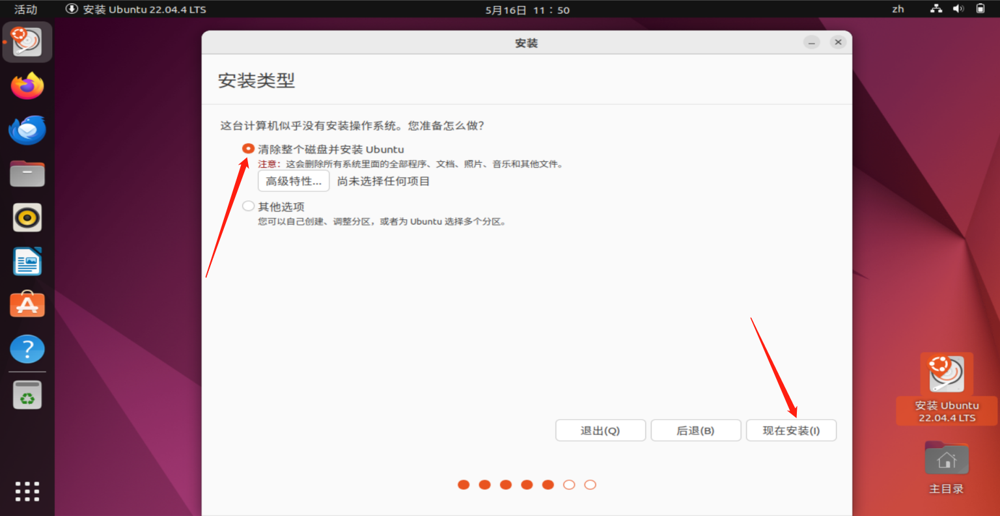

在安装过程中会创建用户，设置密码等，按照自己的用户名、密码、主机名等自定义即可。区域可选择ShangHai

这不会花费太长时间，安装完成之后，我们可以选择重启，这时候我们可以选择`Enter`（回车）重启，这个时候会卸载掉安装镜像文件，重启就会进入到Ubuntu的桌面界面

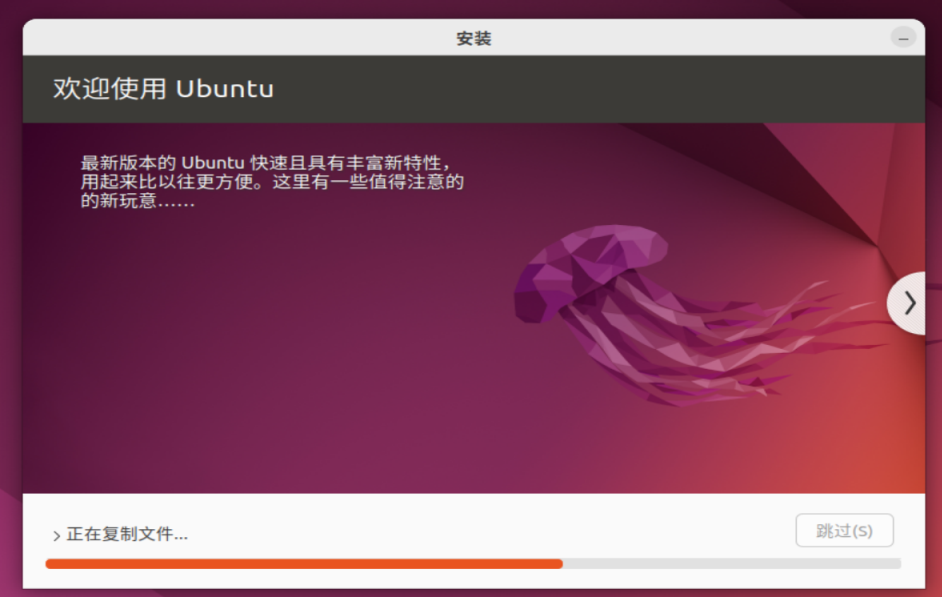

初次进入系统会让我们登录在线账户和Ubuntu Pro，这个可以选择跳过，我们可以选择`跳过`，这样就可以进入到Ubuntu的桌面界面了

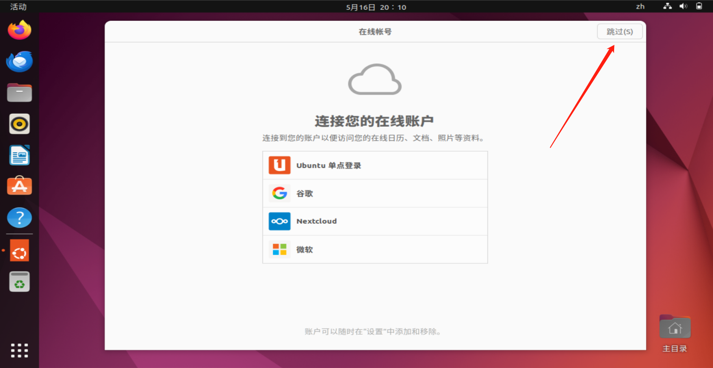

这里还有一个小问题，发送报告，我们可以选择不发送，但是如果你想对Ubuntu做出贡献，可以选择发送，这样可以帮助Ubuntu更好的发展。（Maybe?）

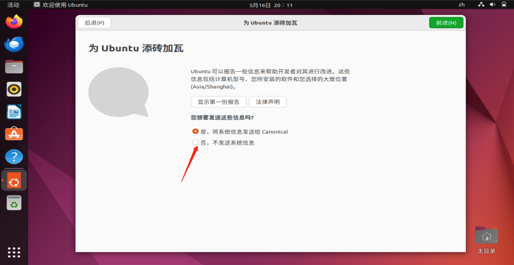

### 3. 更换软件源

我们可以更换软件源，这样可以加快软件的下载速度，打开`软件和更新`，选择`下载自`，选择`其他站点`，然后选择`选择最佳服务器`，这样就可以自动选择最佳的软件源了。

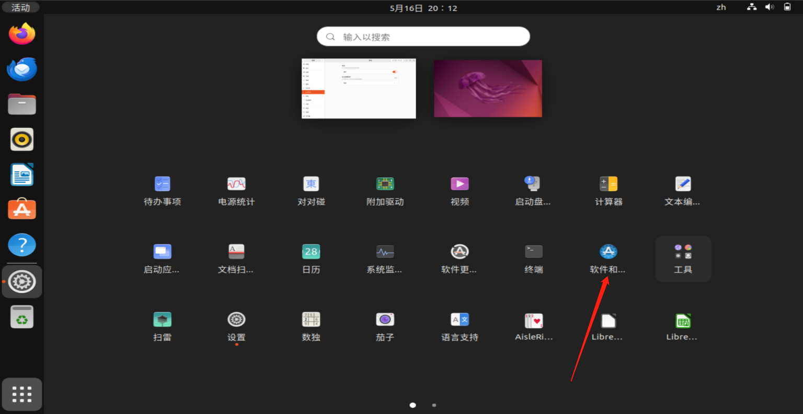
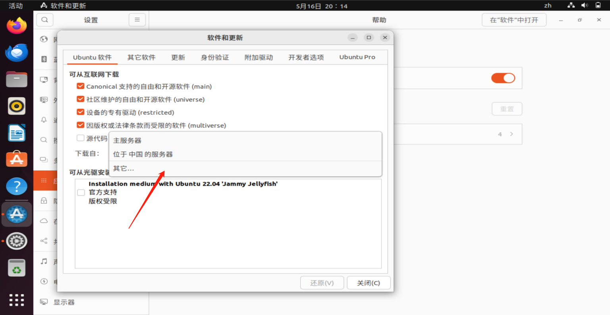
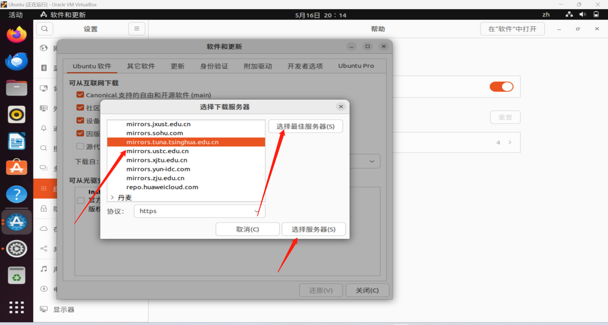

我因为是校园网，所以选择的是`清华大学开源镜像站`

接下来运行`sudo apt update`，更新软件源。

#### 如果你遇到了`E:部分素引文件下载失败。如果忽略它们，那将转而使用旧的素引文件`

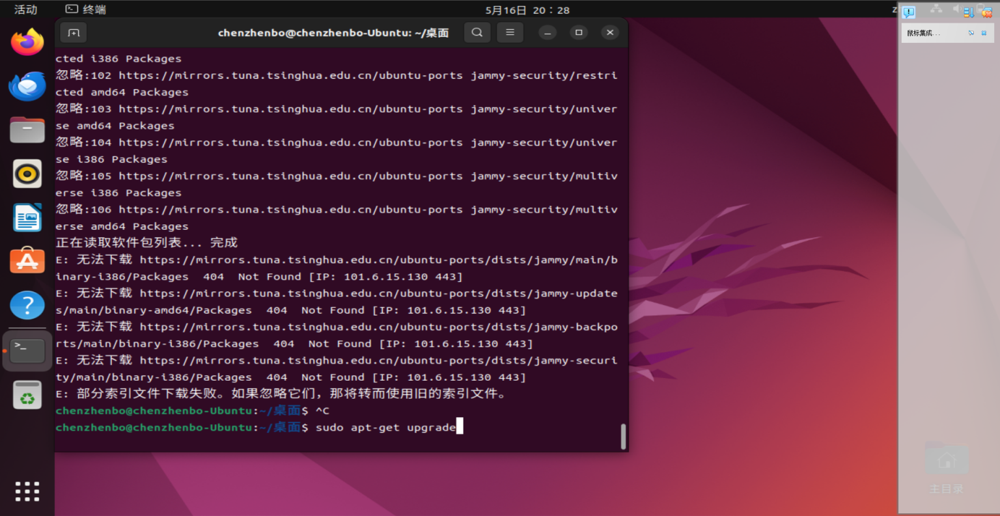

这个时候需要我们去`/etc/apt/sources.list`文件中更改

首先我们先去[清华大学开源软件镜像站Ubuntu帮助](https://mirror.tuna.tsinghua.edu.cn/help/ubuntu/)找到我们的Ubuntu版本，然后复制下面的链接

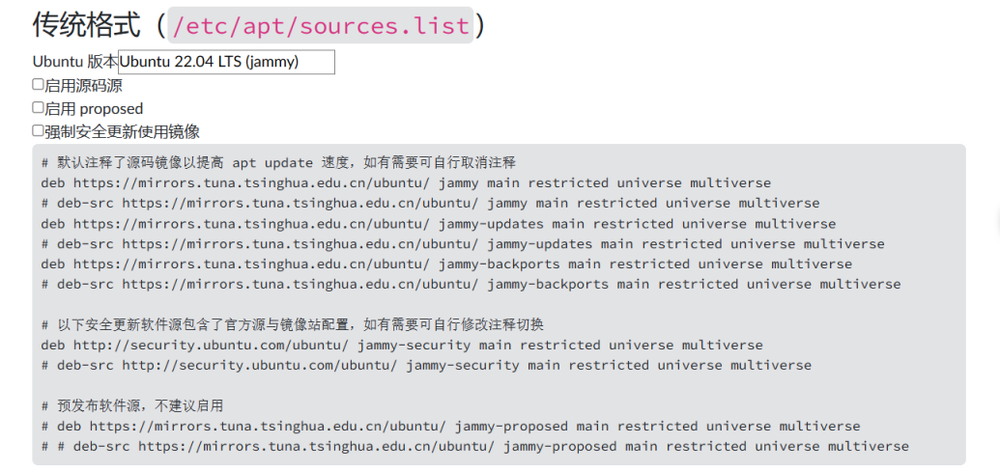

执行`sudo nano /etc/apt/sources.list`，然后将原来的链接替换成我们复制的链接，然后保存退出。

nano 的操作可以自行百度，这里不再赘述。

替换完成之后再次执行`sudo apt upgrade`和`sudo apt update`，这样就可以更新成功了。

尽请享受Ubuntu的世界吧！
