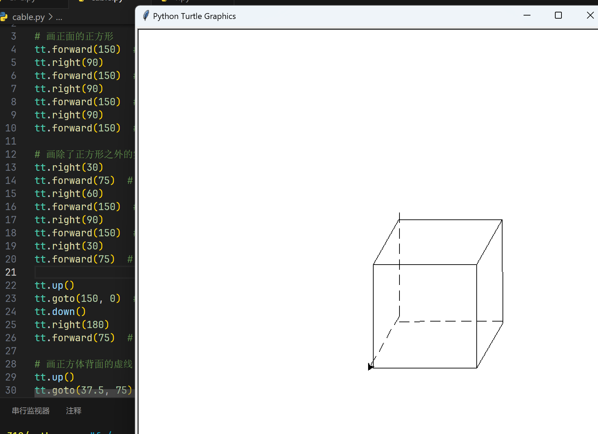
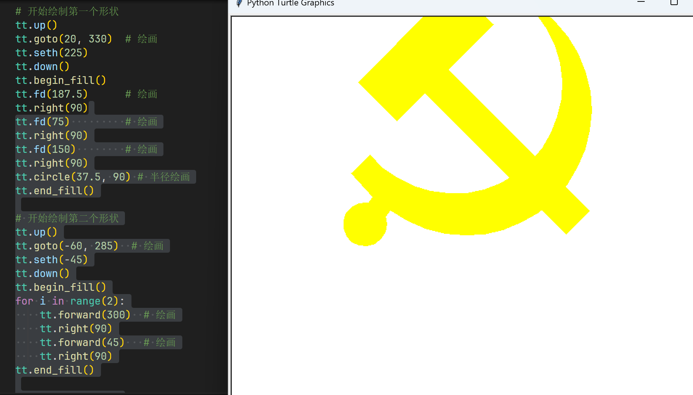

# Python 实验一实验报告

## 实验目的

- 熟悉Python语言的基本语法
- 能够使用turtle工具绘制图形
- 能够描述算法的基本思想

## 实验内容

请采用Python中turtle工具绘制两幅具体中国特色的图案，并对算法进行相应的描述

## 代码实现

cabel.py

```python
import turtle as tt  

# 画正面的正方形
tt.forward(150)  # 100 * 1.5
tt.right(90)
tt.forward(150)  # 100 * 1.5
tt.right(90)
tt.forward(150)  # 100 * 1.5
tt.right(90)
tt.forward(150)  # 100 * 1.5

# 画除了正方形之外的实线
tt.right(30)
tt.forward(75)  # 50 * 1.5
tt.right(60)
tt.forward(150)  # 100 * 1.5
tt.right(90)
tt.forward(150)  # 100 * 1.5
tt.right(30)
tt.forward(75)  # 50 * 1.5

tt.up()
tt.goto(150, 0)  # 100 * 1.5
tt.down()
tt.right(180)
tt.forward(75)  # 50 * 1.5

# 画正方体背面的虚线
tt.up()
tt.goto(37.5, 75)  # 25 * 1.5, 50 * 1.5
tt.down()
tt.right(150)

i = 1
while i < 8:
  tt.forward(15)  # 10 * 1.5
  tt.up()
  tt.forward(7.5)  # 5 * 1.5
  tt.down()
  i += 1

tt.right(270)

n = 1
while n < 8:
  tt.forward(15)  # 10 * 1.5
  tt.up()
  tt.forward(7.5)  # 5 * 1.5
  tt.down()
  n += 1

tt.up()
tt.goto(37.5, -75)  # 25 * 1.5, -50 * 1.5
tt.down()
tt.right(120)

m = 1
while m < 5:
  tt.forward(15)  # 10 * 1.5
  tt.up()
  tt.forward(7.5)  # 5 * 1.5
  tt.down()
  m += 1

tt.up()
tt.done()
```

cpc.py

```python
import turtle as tt

# 设置初始颜色
tt.fillcolor("yellow")
tt.pencolor("yellow")

# 开始绘制第一个形状
tt.up()
tt.goto(20, 330)  # 绘画
tt.seth(225)
tt.down()
tt.begin_fill()
tt.fd(187.5)      # 绘画
tt.right(90)
tt.fd(75)         # 绘画
tt.right(90)
tt.fd(150)        # 绘画
tt.right(90)
tt.circle(37.5, 90) # 半径绘画
tt.end_fill()

# 开始绘制第二个形状
tt.up()
tt.goto(-60, 285)  # 绘画
tt.seth(-45)
tt.down()
tt.begin_fill()
for i in range(2):
    tt.forward(300)  # 绘画
    tt.right(90)
    tt.forward(45)   # 绘画
    tt.right(90)
tt.end_fill()

# 开始绘制第三个形状
tt.up()
tt.goto(-150, 150)  # 绘画
tt.seth(-50)
tt.down()
tt.begin_fill()
tt.circle(150, 180)  # 半径绘画
tt.fd(30)            # 绘画
tt.right(157)
tt.circle(-172.5, 190) # 
tt.left(90)
tt.fd(30)            # 绘画
tt.right(90)
tt.fd(30)            # 绘画
tt.right(90)
tt.fd(30)            # 绘画
tt.left(80)
tt.fd(45)            # 绘画
tt.end_fill()

# 开始绘制第四个形状
tt.up()
tt.goto(-135, 75)   # 绘画
tt.down()
tt.begin_fill()
tt.circle(30)       # 半径绘画
tt.end_fill()

# 维持面板
tt.done()
```

## 实验结果

绘制出来两幅图案如下：




## 实现思路

cable图形中主要绘制了一个立方体，根据我们之前学过立方体的知识，我们可以知道立方体是由6个正方形组成的，所以我们可以先绘制一个正方形，然后再绘制除了正方形之外的实线，最后再绘制正方体背面的虚线。

另一个我绘制了一个中国共产党的党徽，根据标准制法，首先从20，330左边绘制他的垂直，接下来画出锤子之后，用两个圆充当镰刀，并交会一点，之后填充，形状1就是锤子，形状2 锤子柄，形状三就是镰刀，形状四镰刀柄，具体画法我参照了相关的条例绘制规定。

## 实验总结

通过这次实验，我学会了如何使用Python中的turtle工具绘制图形，同时也学会了如何描述算法的基本思想，这对我以后的学习有很大的帮助。此次实验我们也通过绘制两幅图案，加深了对Python语言的理解，同时也锻炼了我们的动手能力，提高了我们的编程能力。
