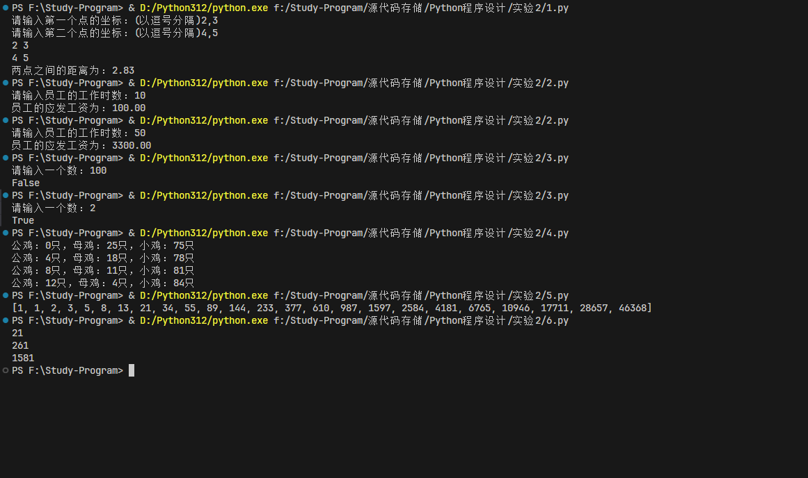

# Python实验二实验报告-选择结构和循环结构

## 实验目的

- 熟悉Python语言的选择结构和循环结构
- 能够使用选择结构和循环结构解决实际问题
- 能够描述算法的基本思想

## 实验内容

1、 输入平面的两个点的坐标，计算两点之间的距离，结果保留两位小数。计算公式为d=((x1-x2)**2+(y1-y2)**2)**0.5。

2、 某公司员工的工资计算方法如下：

（1）工作时数超过120小时者，超过部分加发15%；

（2）工作时数低于60小时者，扣发700元；

（3）其余按每小时80元计发。

输入员工的工作时数，计算应发工资。

3、输入一个数n，判别是否是素数。是，输出True；否，输出False。素数，是只能被1和它本身整除的数。

4、百鸡百钱是我国古代数学家张丘建在《算经》一书中提出的数学问题：“鸡翁一值钱五，鸡母一值钱三，鸡雏三值钱一。百钱买百鸡，问鸡翁、鸡母、鸡雏各几何？”

5、程序设计：古典问题：有一对兔子，从出生后第3个月起每个月都生一对兔子，小兔子长到第三个月后每个月又生一对兔子，假如兔子都不死，问每个月的兔子总数为多少？古典问题：有一对兔子，从出生后第3个月起每个月都生一对兔子，小兔子长到第三个月后每个月又生一对兔子，假如兔子都不死，问每个月的兔子总数为多少？

提示：兔子的规律为数列1,1,2,3,5,8,13,21…

6、 题目：一个整数（1万以内），它加上100后是一个完全平方数，再加上168又是一个完全平方数，请问该数是多少？（完成平方数是指开根号所得结果为整数的数，如4，开根号为2。）

## 代码实现

第一题：

```python
# 输入平面的两个点的坐标，计算两点之间的距离，结果保留两位小数。计算公式为d=((x1-x2)**2+(y1-y2)**2)**0.5。

import math

x1,y1 = eval(input("请输入第一个点的坐标：(以逗号分隔)"))
x2,y2 = eval(input("请输入第二个点的坐标：(以逗号分隔)"))

print(x1,y1)
print(x2,y2)
print("两点之间的距离为：%.2f" % math.sqrt((x1-x2)**2+(y1-y2)**2))
```

第二题：

```python
hours = eval(input("请输入员工的工作时数："))
if hours > 120:
    salary = 120 * 80 + (hours - 120) * 80 * 1.15
elif hours < 60:
    salary = hours * 80 - 700
else:
    salary = hours * 80

print("员工的应发工资为：%.2f" % salary)

```

第三题：

```python
n = eval(input("请输入一个数："))

if n == 1:
    print(False)
else:
    for i in range(2, n):
        if n % i == 0:
            print(False)
            break
    else:
        print(True)

```

第四题：

```python
#百鸡百钱是我国古代数学家张丘建在《算经》一书中提出的数学问题：“鸡翁一值钱五，鸡母一值钱三，鸡雏三值钱一。百钱买百鸡，问鸡翁、鸡母、鸡雏各几何？”
for x in range(0, 21):
    for y in range(0, 34):
        z = 100 - x - y
        if 5*x + 3*y + z/3 == 100:
            print("公鸡：%d只，母鸡：%d只，小鸡：%d只" % (x, y, z))

```

第五题：

```python

rabbits = [1, 1]

for i in range(2, 24):
    rabbits.append(rabbits[-1] + rabbits[-2])
print(rabbits)

```

第六题：

```python
for i in range(1, 10000):
    if (i + 100) ** 0.5 == int((i + 100) ** 0.5) and (i + 268) ** 0.5 == int((i + 268) ** 0.5):
        print(i)
```

## 实验结果



## 实验总结

本次实验中我们学习了Python语言的选择结构和循环结构，通过实际问题的解决，我们更加熟悉了Python语言的基本语法，对算法的基本思想有了更深的理解。以及如何应用简单的选择结构和循环结构解决实际问题。
