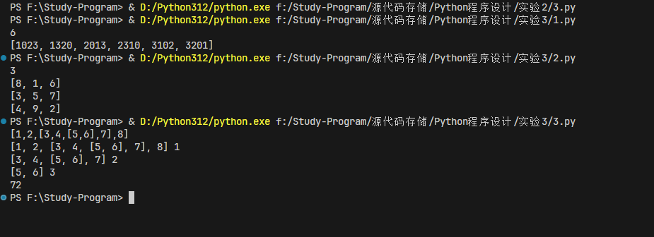

# Python实验三实验报告-列表

## 实验目的

- 了解列表的基本概念
- 掌握列表的基本操作
- 掌握列表的常用方法

## 实验内容

1、奇特的四位数：一个四位数，各位数字互不相同，所有数字之和等于6，并且这个数是11的倍数。满足这种要求的四位数有多少个？各是什么？

输出要求：

第一行输出符合条件的数字个数**

第二行以列表形式输出所有满足条件的四位数，列表元素按由小到大顺序排列

2、幻方，就是一个N*N的矩阵中填入1至N的平方,使得每行、每列，以及两条对角线上的数之和都相等。当N为奇数时，可用以下的方法来填数。

（1）将1填入第一行的中间；
（2）将数字下一个数填在右上方。
    （i) 出现越界。若越过第一行，则折返回最后一行。若越过最后一列，则折返回第一列。
    （ii）没越界，但右上方已有数了，此时将其填在上一个数的正下方。
（3）对于矩阵的最右上方的格子（第一行最后一列）要特殊处理，因为下一个数同时越过第一行和最后一列，折返时的格子也已经有数了。因此特殊处理，将其填在第二行的最后一列即可
编程输出奇数阶幻方。

输入输出示例|输入 | 输出 |

| -------- | ------ | ------------------------------- |
| 示例 1 | 3    | [8, 1, 6] [3, 5, 7] [4, 9, 2] |

3、输入一个嵌套列表，嵌套层次不限，根据层次，求列表元素的加权和。第一层每个元素 的值为：元素值*1，第二层每个元素的值为：元素值*2，第三层每个元素的值为：元素值*3， ...,以此类推！

输入样例:在这里给出一组输入。例如：

[1,2,[3,4,[5,6],7],8]

输出样例:在这里给出相应的输出。例如：

72

## 代码实现

1、奇特的四位数

```python
# 一个四位数，各位数字互不相同，所有数字之和等于6，并且这个数是11的倍数。满足这种要求的四位数有多少个？各是什么？
count = 0
result = []
for i in range(1000, 10000):
    if i % 11 == 0:
        a = i // 1000
        b = i // 100 % 10
        c = i // 10 % 10
        d = i % 10
        if a + b + c + d == 6 and len(set([a, b, c, d])) == 4:
            count += 1
            result.append(i)
print(count)
print(result)
```

2、幻方

```python
#幻方，就是一个N*N的矩阵中填入1至N的平方,使得每行、每列，以及两条对角线上的数之和都相等。当N为奇数时，可用以下的方法来填数。

#（1）将1填入第一行的中间；
#（2）将数字下一个数填在右上方。
#（i)出现越界。若越过第一行，则折返回最后一行。若越过最后一列，则折返回第一列。
#（ii）没越界，但右上方已有数了，此时将其填在上一个数的正下方。
#（3）对于矩阵的最右上方的格子（第一行最后一列）要特殊处理，因为下一个数同时越过第一行和最后一列，折返时的格子也已经有数了。因此特殊处理，将其填在第二行的最后一列即可.
# 编程输出奇数阶幻方。
n = int(input())
magic = [[0]*n for i in range(n)]
x, y = 0, n//2
for i in range(1, n*n+1):
    magic[x][y] = i
    x -= 1
    y += 1
    if i % n == 0:
        x += 2
        y -= 1
    elif y == n:
        y = 0
    elif x < 0:
        x = n - 1
    elif magic[x][y]:
        x += 2
        y -= 1
for i in range(n):
    print(magic[i])
```

3解答
  
```python
# 输入一个嵌套列表，嵌套层次不限，根据层次，求列表元素的加权和。第一层每个元素 的值为：元素值*1，第二层每个元素的值为：元素值*2，第三层每个元素的值为：元素值*3， ...,以此类推！

def sum_list(lst, level=1):
    print(lst, level)
    s = 0
    for i in lst:
        #如果是列表，递归调用
        if isinstance(i, list):
            s += sum_list(i, level+1)
        else:
            s += i * level
    return s
print(sum_list(eval(input())))
```

## 实验结果



## 实验总结

通过本次实验，我了解到了列表的基本概念，掌握了列表的基本操作和常用方法。在实验中，我通过编写代码实现了奇特的四位数、幻方和嵌套列表的加权和。在实验过程中，我对列表的操作有了更深入的了解，提高了自己的编程能力。
