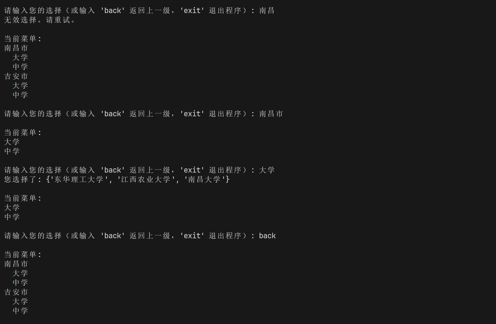

# Python实验四实验报告-函数与字典

## 实验目的

- 了解Python函数的定义和调用
- 了解Python字典的定义和使用
- 掌握Python函数的参数传递
- 掌握Python字典的增删改查操作

## 实验内容

1、1. (简答题)
模拟通讯录的数据修改功能。
def menu():

    print('''\n欢迎使用PYTHON学生通讯录

1：添加学生

2：删除学生

3：修改学生信息

4：搜索学生

5：显示全部学生信息

6：退出并保存''')

dic={'张自强': ['12652141777', '材料'], '庚同硕': ['14388240417', '自动化'], '王岩': ['11277291473', '文法']}

要求编写程序

输出字典原始数据，再调用menu函数输出用户选择界面，等待用户输入：
（1）输入‘3’ 进行修改学生信息，输入姓名，如果该姓名已存在，则继续输入电话，学院信息，并输出“Success”的提示信息，如果不存在，给出“No Record”提示信息。
无论是否修改成功，结束后需要输出操作后的字典数据。
（2）如果输入其他选项，无需读入姓名，直接输出“ERROR”

2、利用字典相关知识设计三级菜单，并实现每一级菜单间跳跃

## 代码实现

第一题代码实现

```python
  def menu():
    print('''\n欢迎使用PYTHON学生通讯录
  1：添加学生
  2：删除学生
  3：修改学生信息
  4：搜索学生
  5：显示全部学生信息
  6：退出并保存''')
    
  dic = {'张自强': ['12652141777', '材料'], '庚同硕': ['14388240417', '自动化'], '王岩': ['11277291473', '文法']}

  def modify_student_info():
    name = input("请输入要修改的学生姓名: ")
    if name in dic:
      phone = input("请输入新的电话: ")
      college = input("请输入新的学院: ")
      dic[name] = [phone, college]
      print("Success")
    else:
      print("No Record")
    print("操作后的字典数据: ", dic)

  def main():
    print("字典原始数据: ", dic)
    menu()
    choice = input("请输入您的选择: ")
    if choice == '3':
      modify_student_info()
    else:
      print("ERROR")

  if __name__ == "__main__":
    main()
```

第二题代码实现

```python
  def print_menu(menu, level=1):
    for key in menu:
      print(f"{'  ' * (level - 1)}{key}")
      if isinstance(menu[key], dict):
        print_menu(menu[key], level + 1)

  def navigate_menu(menu):
    current_menu = menu
    path = []

    while True:
      print("\n当前菜单:")
      print_menu(current_menu)
      choice = input("\n请输入您的选择（或输入 'back' 返回上一级，'exit' 退出程序）: ").strip()

      if choice == 'exit':
        break
      elif choice == 'back':
        if path:
          current_menu = path.pop()
        else:
          print("您已经在顶级菜单。")
      elif choice in current_menu:
        if isinstance(current_menu[choice], dict):
          path.append(current_menu)
          current_menu = current_menu[choice]
        else:
          print(f"您选择了: {current_menu[choice]}")
      else:
        print("无效选择。请重试。")

  if __name__ == "__main__":
    data = {
      '江西省':{
        '南昌市':{
          '大学':{"南昌大学","东华理工大学","江西农业大学"},
          '中学':{"南昌一中","南昌二中","南昌三中"},
        },
        '吉安市':{
          '大学':{"井冈山大学"},
          '中学':{"吉安一中","吉安二中"},
        }
      },
      '北京市':{
        '海淀区':{
          '大学':{"北京大学","清华大学"},
          '中学':{"海淀一中","海淀二中"},
        },
        '朝阳区':{
          '大学':{"中央财经大学","北京外国语大学"},
          '中学':{"朝阳一中","朝阳二中"},
        }
      }
    }

    navigate_menu(data)

```

## 实验结果




## 实验总结

本次实验主要学习了Python函数的定义和调用，以及Python字典的定义和使用。通过实验，我掌握了Python函数的参数传递和Python字典的增删改查操作。在实验中，我实现了模拟通讯录的数据修改功能和设计了三级菜单，并实现了每一级菜单间的跳跃。通过本次实验，我对Python函数和字典有了更深入的了解，提高了自己的编程能力。
