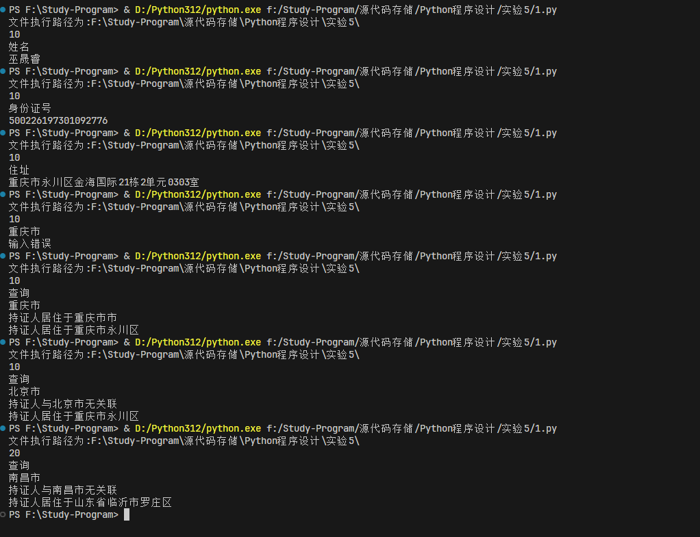
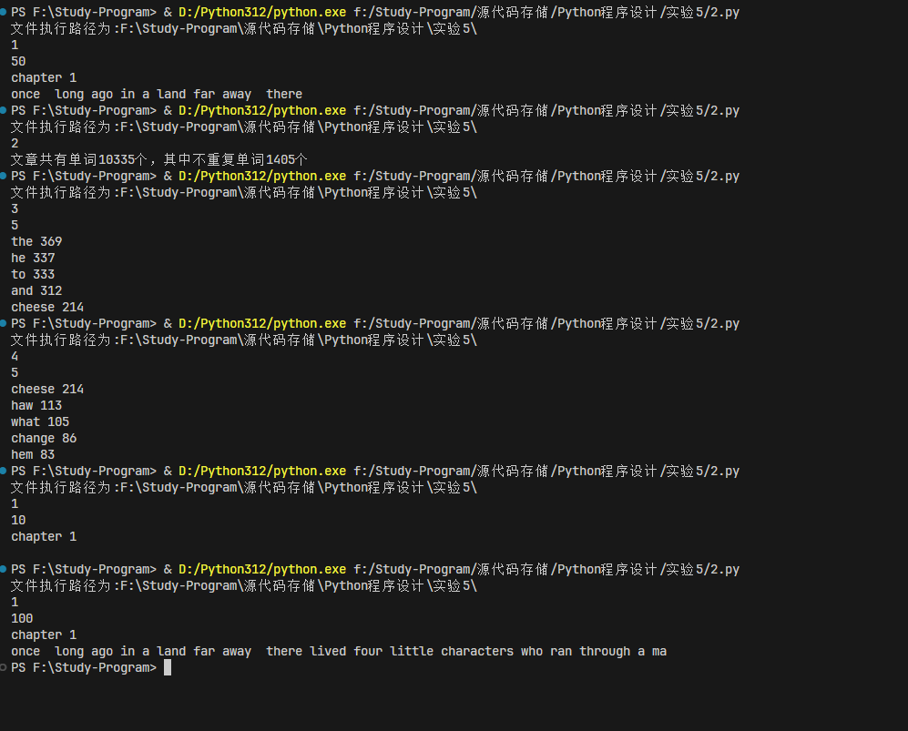
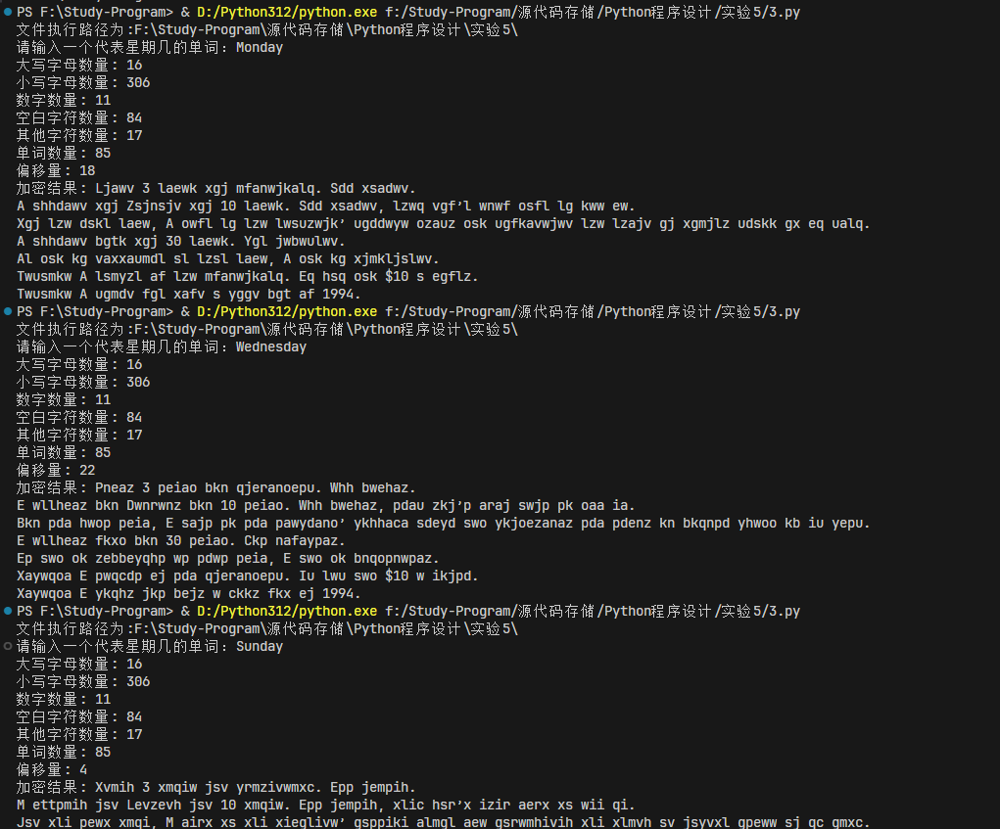
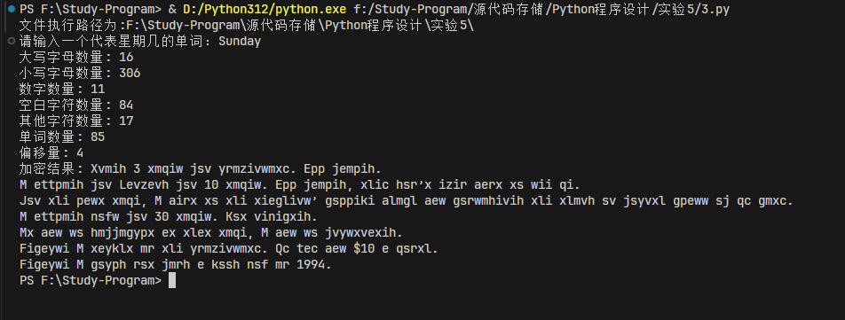

# Python实验五实验报告-文件

## 实验目的

- 了解Python文件操作
- 掌握Python文件读写操作
- 掌握Python文件指针操作

## 实验内容

1、描述

通过查验居民身份证可以掌握持证人的姓名、性别、出生日期、住址和公民身份号码等信息，还可以获得居住地和出生地信息。

疫情期间，需要通过查验身份证来实现对一些出生或居住在高风险地区的人进行身份校验，现在需要你开发这样一个系统，具有以下功能：

1 为测试以上功能，模拟产生一个身份证上的全部信息。具体方法为

1.1 输入一个整数作为随机因子

1.2 模拟产生姓名，从百家姓中抽取一个姓，注意百家姓文件中前51行为单姓，51行后面为双字复姓。根据性别从男或女性常用名中取机抽取一个名字。

1.3 模拟产生出生日期（本题限制年份范围为1900-2020），性别随机男或女、民族从56个民族中随机取一个。

1.4 模拟产生住址，地，省、市、县区随机，随机一个小区village，楼栋号building限制[1-30]中随机，单元号door限制[1-7]中随机，楼层号floor限制[01-35]中随机，房间号room限制[01-04]中随机。格式为{village} {building}栋{door}单元{floor}{room}室

1.5 模拟生成身份号码，出生序号随机。

1.6 按身份证格式打印输出模拟产生的身份证

输入“姓名”、“性别”、“身份证号”、“住址”、“身份证”之一时，分别输出对应的信息。若输入为“查询”，则再输入一个城市名，根据城市名判定持证人是否为敏感地区常住人或是敏感地区出生者，输出“持证人与某某市有关联”或“持证人与某某市无关联”，并输出持证有居住的省、市、区（县）或市、区（居住于直辖市时）。输入其他信息时，输出“输入错误”

为实现自动评测，本题要求使用choice()函数多字符序列中获取一个元素。

本地测试时，将附件中的百家姓、男和女性的常用名、身份证地区与地区码、常用小区名、民族等数据文件下载并保存到python文件所在的文件夹中。

常用名和民族等文件只有一行，可以用readline()读取为一个字符串再进行处理。

2、
《谁动了我的奶酪？》是美国作家斯宾塞·约翰逊创作的一个寓言故事，该书首次出版于1998年。书中主要讲述4个“人物”—两只小老鼠“嗅嗅(Sniff)”、“匆匆(Scurry)”和两个小矮人“哼哼(Hem)”、“唧唧(Haw)”找寻奶酪的故事。

文件“Who Moved My Cheese.txt”中包含这个故事的中英文，格式如下：

avatar

请按照函数的注释，补充程序中缺失部分语句，按要求实现如下程序功能：

read_file()函数将文件中的内容读为字符串，过滤掉中文，只保留文件中的英文字母和西文符号(只保留ASCII码字符)。所有字符转为小写，将其中所有标点、符号替换为空格。

count_of_words()函数统计read_file()函数返回的字符串中的单词数量和不重复的单词数量。

top_ten_words()函数分行依次输出出现次数最多的n个单词及其出现次数。

word_frequency()函数统计并以字典类型返回每个单词出现的次数。

top_ten_words_no_excludes()函数统计并输出去除常见的冠词、代词、系动词和连接词后，出现次数最多的 cnt个单词及其出现次数。

根据用户输入的指令和任务完成程序：

若输入指令为“1”，则在下一行中输入一个非负整数n，并输出read_file()函数返回值的前n个字符。 若输入指令为“2”，并调用count_of_words()函数统计输出read_file()函数返回的字符串中的单词数量和不重复的单词数量，格式参考下面的输入输出示例，其中的XXXX需用统计出的实际数值替换。 若输入指令为“3”，则在下一行中输入一个正整数n，并调用top_ten_words()函数分行依次输出出现次数最多的n个单词及其出现次数，单词和次数之间以空格间隔。 若输入指令为“4”，则在下一行中输入一个非负整数n，并调用top_ten_words_no_excludes()函数从词频统计结果中去除常见的冠词、代词、系动词和连接词后统计词频，再输出出现次数最多的n个单词及其出现次数，单词和次数之间以空格间隔。需排除的单词包括：['a', 'an', 'the', 'i', 'he', 'she', 'his', 'my', 'we','or', 'is', 'was', 'do', and', 'at', 'to', 'of', 'it', 'on', 'that', 'her', 'c','in', 'you', 'had', 's', 'with', 'for', 't', 'but', 'as', 'not', 'they', 'be', 'were', 'so', 'our', 'all', 'would', 'if', 'him', 'from', 'no', 'me', 'could', 'when', 'there', 'them', 'about', 'this', 'their', 'up', 'been', 'by', 'out', 'did', 'have']

3、读取附件中的文件，完成以下操作：

1.分类统计文件中大写字母、小写字母、数字、空白字符（包括空格、\n、\t等，可用isspace()方法判断）和其他字符的数量

2.输出文件中单词的数量（将其中所有标点符号替换为空格，再根据空格对字符串进行切分可以得到元素为单词的列表。数字按单词统计，如“ 1994” 计算一个单词）

3.用恺撒加密方法对上述文件内容进行加密，为提高加密强度，约定输入一个秘密单词来产生偏移量，偏移量计算方法为先计算用户输入的字符串中每个字符的ASCII值的和，再对26取模，结果作为偏移量。为避免偏移量恰好为0，本题约定秘密单词为用于表示星期几的单词，即'Monday', 'Tuesday', 'Wednesday', 'Thursday', 'Friday', 'Saturday', 'Sunday'中的一个。

在密码学中，凯撒密码是一种最简单且最广为人知的加密技术。“恺撒密码”据传是古罗马恺撒大帝用来保护重要军情的加密系统。它是一种替换加密的技术，明文中的所有字母都在字母表上向后（或向前）按照一个固定数目进行偏移后被替换成密文。例，当偏移量是3的时候，所有的字母A将被替换成D，B变成E，以此类推，小写字母也一样处理，其他字符忽略，不作任何改变。

输入格式
一个代表星期几的单词，'Monday', 'Tuesday', 'Wednesday', 'Thursday', 'Friday', 'Saturday', 'Sunday'中的一个
输出格式

依序输出：

1.文件中大写字母、小写字母、数字、空白字符和其他字符的数量
2.文件中单词的数量
3.偏移量
4.用恺撒加密方法对上述文件内容进行加密的结果

## 代码实现

```python


# 通过查验居民身份证可以掌握持证人的姓名、性别、出生日期、住址和公民身份证号码等信息，还可以获得居住后和出生地信息。
# 疫情期间，需要通过查验身份证来实现对一些出生或居住在敏感地区的人进行监控，现在需要你开发这样一个系统，具有以下功能：
# 1.为测试以上功能，模拟产生一个身份证上的全部信息。具体方法为
# 1.1 模拟姓名，从百家姓中抽取一个姓，注意百家姓文件中前51行为单姓，51行后面为双字复姓。根据性别从男或女性常用名中取机抽取一个名字。
# 1.2 模拟出生日期（限制1900-2020），性别随机男女、民族从56个民族中随机取一个
# 1.3 模拟住址，省、市、县区随机，随机一个小区、100以内整数楼号、房间号格式为 a - b0c,a 为 1-8， b为 0-35，c 为 1-4
# 1.4  模拟生成身份证号，出生序号随机。
# 1.5 按身份证格式打印输出模拟产生的身份证
# 2.输出年龄和性别
# 3.获取和输出身份证注册地的省、市、县（区）
# 4.获取持证人居住地的省、市、县（区）
# 5.根据输入设置敏感地区，判定持证人是否为敏感地区常住人或是敏感地区出生者。

import random
import datetime


def person_name(gender_of_id, last_name_file, male_name_file, female_name_file):
    """
    @参数 gender_of_id：性别，字符串类型
    @参数 last_name_file：百家姓文件名，字符串类型
    @参数 male_name_file：男性常用名文件名，字符串类型
    @参数 female_name_file：女性常用名文件名，字符串类型
    接收性别、百家姓文件名、男性常用名文件名、女性常用名文件名为参数
    先随机抽取一个姓氏，再根据性别随机抽取名字，
    返回表示姓名的字符串。
    """
    with open(last_name_file, 'r', encoding='utf-8') as data:
        last = [line.strip().replace('，', '').replace('。', '')
                for line in data]

    last1 = ''.join(last[:51])
    last2 = ''.join(last[51:])
    last = list(last1) + [last2[i * 2: i * 2 + 2] for i in range(len(last2) // 2)]  # 得到姓的列表
    last_name = random.choice(last)                                                 # 随机一个姓

    with open(male_name_file, 'r', encoding='utf-8') as data:
        male_name = data.readline().split()
    with open(female_name_file, 'r', encoding='utf-8') as data:
        female_name = data.readline().split()
    if gender_of_id == '男':
        first_name = random.choice(male_name)
    else:
        first_name = random.choice(female_name)
    return last_name + first_name


def area_code(area_file):
    """
    @参数 area_file：包含地区编码的文件名，字符串类型
    传入参数为包含地区编码和地区名的文件名的字符串，以地区编码为键，地区名为值构建字典作为返回值。
    """    
    area_of_birth = {}
    with open(area_file, 'r', encoding='utf-8') as data:
        for x in data:
            ls = x.strip().split(',')
            area_of_birth[ls[0]] = ls[1]        # 得到保存地区编码的字典
    return area_of_birth


def birthdate():
    """在1900-2020间随机抽取一个数字作为出生年份，再随机生成一个合法的包含月和日的日期。需
    要注意月份范围为1-12，1、3、5、7、8、10、12月的日期范围为1-31，4、6、9、11的日期范围为1-30，闰年2月
    的日期范围为1-29，平年2月的日期范围为1-28。年为4位字符串，月和日均为2位字符串，依序构成长
    度为8的字符串作为返回值，例如19840509 """
    # year_of_birth = random.choice(range(1900, 2020))
    # days_of_rand = datetime.timedelta(days=random.randint(1, 366))
    # date_of_birth = datetime.date.today() + days_of_rand         # 月份和日期项
    # return str(year_of_birth) + date_of_birth.strftime('%m%d')   # 19840509
    year_of_birth = random.choice(range(1900, 2020))
    days_of_rand = datetime.timedelta(days=random.randint(1, 366))
    date_of_birth = datetime.datetime.strptime(str(year_of_birth)+'0101', "%Y%m%d") + days_of_rand          # 月份和日期项
    return date_of_birth.strftime("%Y%m%d")  # 19840509


def order_number(gender_of_id):
    """接收表示性别的字符串为参数，随机抽取1-99之间的整数作为生出顺序号，根据传入的性别随
    机抽取第17位序号数字，男性为偶数，女性为奇数。
    返回值为2位的顺序号，字符串类型
    """
    num = random.choice(range(1, 100))
    # gender_num = random.choice('13579') if gender_of_id == '男' else random.choice('02468')
    if gender_of_id == '男':
        gender_num = random.choice('13579')
    else:
        gender_num = random.choice('02468')

    return '{:02}'.format(num) + str(gender_num)


def id_of_17(area_of_code, birth_date, birth_order):
    """
    @参数 area_of_code：地区码字典
    @参数 birth_date：字符串
    @参数 birth_order：字符串
    接收地区码字典，出生日期和出生顺序号，随机抽取一个地区码，返回身份证号前17位的字符串。
    需要注意的是，抽取地区码时，要避免抽取到省或地级市的编码(最后2位编码为0)。
    """
    area_no_city = [x for x in area_of_code.keys() if x[-2:] != '00']
    area_id = random.choice(area_no_city)  # 避免抽到省市的编码
    return area_id + birth_date + birth_order


def id17_to_18(id_number):
    """
    @ 参数 id_number：身份证号前17位，字符串
    为身份证号增加校验位，接收身份证号码前17位，返回18位身份证号，校验码的计算方法为：
    1. 将前面的身份证号码17位数分别乘以不同的系数。第一位到第十七位的系数分别为:
       7、9、10、5、8、4、2、1、6、3、7、9、10、5、8、4、2 ;
    2. 将这17位数字和系数相乘的结果相加;
    3. 用加出来和除以11，看余数是多少;
    4. 余数只可能有0、1、2、3、4、5、6、7、8、9、10这11个数字。
       其分别对应的最后一位身份证的号码为1、0、X、9、8、7、6、5、4、3、2，其中的X是罗马数字10;
    5. 通过上面得知如果余数是2，就会在身份证的第18位数字上出现罗马数字的Ⅹ；如果余数是10，
       身份证的最后一位号码就是2。
       返回值为18位身份证号，字符串类型。
    """
    ls =[7,9,10,5,8,4,2,1,6,3,7,9,10,5,8,4,2]
    ecc=[1,0,'X',9,8,7,6,5,4,3,2]
    s=sum([int(id_number[i])*ls[i] for i in range(17)])
    id_number += str(ecc[s%11])
    return id_number


def village_of_live(village_file, area_of_code):
    """
    @ 参数 village_file：包含常见小区名的文件名，字符串类型
    @ 参数 area_of_code：地区编码，字典类型
    从village_file中随机选择一个小区名，从area_of_code中随机选择一个地区编码，并从中获取省、市、
    县(区)名。楼栋号限制[1-30]中随机，单元号限制[1-7]中随机，楼层号限制[1-35]中随机，
    房间号限制[1-4]中随机。
    返回值为居住地址和地区编码，均为字符串类型。
    """
    with open(village_file, 'r', encoding='utf-8') as data:
        village_live = data.readline().split()
    village = random.choice(village_live)
    building = random.choice(range(1, 30))
    door = random.choice(range(1, 7))
    floor = random.choice(range(1, 35))
    room = random.choice(range(1, 4))
    area_id = random.choice([x for x in list(area_of_code.keys()) if x[-2:] != '00'])  # 避免抽到省市的编码
    #通过area_id获取省市县(区)名
    province = area_of_code.get(area_id[:2]+'0000', '')
    city = area_of_code.get(area_id[:4]+'00', '')
    area = area_of_code[area_id]
    if area_id[:2] in ['11', '12', '31', '50']:          # 北京市，上海市，天津市，重庆市
        address_of_live = f'{province}{area}'
    else:
        address_of_live = f'{province}{city}{area}'
    address_of_live = address_of_live + f'{village}{building}栋{door}单元{floor:02}{room:02}室'
    return address_of_live, area_id


def all_of_nation(nation_file):
    """
    @参数 nation_file：文件名，字符串类型
    传入参数为包含民族的文件名，从中随机抽取一个民族为返回值。
    需要注意的是，返回值里不包含'族'字，例如抽取'蒙古族',返回值为'蒙古'。
    """
    with open(nation_file, 'r', encoding='utf-8') as data:
        nation = data.readline().split()
    return random.choice(nation).replace('族', '')


def print_id(full_name, gender_of_id, id_number, address, nation, birth_date):
    """
    @ 参数 full_name：姓名，字符串类型
    @ 参数 gender_of_id： 性别，字符串类型
    @ 参数 id_number：公民身份证号， 字符串类型
    @ 参数 address：住址， 字符串类型
    @ 参数 nation：民族， 字符串类型
    @ 参数 birth_date：出生年月日， 字符串类型
    按身份证正面的格式输出完整的身份信息，包括：
    姓名
    性别   民族
    出生年月日
    住址
    公民身份号码"""
    print('-------------------------------------------------')
    print()
    print(f'  姓  名  {full_name}')
    print(f'  性  别  {gender_of_id}   民族  {nation}')
    print(f'  出  生  {birth_date[:4]} 年 {int(birth_date[4:6])} 月 {int(birth_date[6:])} 日')
    print(f'  住  址  {address[0]}')
    print()
    print(f'  公民身份号码 {id_number}')
    print('-------------------------------------------------')


# 获取和输出身份证注册地的省、市、县（区）
def area_of_registration(id_number, area_of_code):
    """
    @参数 id_number：身份证号，字符串
    @参数 area_of_code：地区编码，字典
    接收身份证号和地区编码的字典为参数，返回持证人身份证注册地址的省市县(区)。
    省的编码末4位为0
    地级市(区)编码末2位为0
    需要注意的是，若持证人注册地为直辖市，则住址中无地级市，直接输出市和区，例如：北京市朝阳区
    其他地区格式例如：湖北省武汉市洪山区。
    """
    province = area_of_code[id_number[:2] + '0000']
    # 直辖市'11', '12', '31', '50'
    if id_number[:2] in ['11', '12', '31', '50']:
        district = area_of_code[id_number]
        return f'持证人出生于{province}{district}'
    else:
        city = area_of_code[id_number[:4] + '00']
        district = area_of_code[id_number]
        return f'持证人出生于{province}{city}{district}'


def area_of_live(area_id, area_of_code):
    """
    @参数 area_id：居住地编码，字符串
    @参数 area_of_code：地区编码，字典
    接收居住地编码和地区编码字典为参数，返回持证人居住地址的省市县(区)
    需要注意的是，若持证人居住地为直辖市，则住址中无地级市，直接输出市和区，例如：北京市朝阳区
    其他地区格式例如：湖北省武汉市洪山区。
    """
    province = area_of_code[area_id[:2] + '0000']
   #直辖市'11', '12', '31', '50'
    if area_id[:2] in ['11', '12', '31', '50']:
        district = area_of_code[area_id]
        return f'持证人居住于{province}{district}'
    else:
        city = area_of_code[area_id[:4] + '00']
        district = area_of_code[area_id]
        return f'持证人居住于{province}{city}{district}'


# 查验城市的编码
def check_city_code(city_name, area_of_code):
    """接收一个表示城市名的字符串参数和地区编码，若城市名存在，返回值为该城市对应的地区编码，6位字符串。
    若城市名不存在，返回False。
    @参数 city_name：城市名，字符串
    @参数 area_of_code：地区编码，字典类型
    """
    for key, value in area_of_code.items():
        if city_name in value:
            return key
    return False


def check_city(id_number, city_name, city_code, area_live):
    """
    @ 参数 id_number：身份证号，字符串类型
    @ 参数 city_name：查验城市名，字符串类型
    @ 参数 city_code：城市编码，字符串类型
    @ 参数 area_live：居住地信息，字符串类型
    接收参数身份证号，查验城市名和城市编码，居住地信息，查验持证人是否与指定的城市相关
    若居住地与查验城市名相同，返回持证人居住于city_name市
    否则若出生地与查验城市相同，返回持证人出生于city_name市
    其他情况返回持证人与city_name无关联。以及持证人居住信息。
    返回值均为字符串类型。
    """
    if city_name in area_live:
        return f'持证人居住于{city_name}市'
    elif city_code in id_number[:6]:
        return f'持证人出生于{city_name}市'
    else:
        return f'持证人与{city_name}无关联'
    


def age_of_id(id_number):
    """接收身份证号为参数，返回值为持证人年龄和性别。
    年龄的计算方式为当前年份减出生年份。
    @参数 id_number：身份证号，字符串类型。
    """
    current_year = datetime.datetime.now().year
    gender = '男' if id_number[16] in '13579' else '女'
    age = current_year - int(id_number[6:10])
    return gender, age


def judge(txt):
    """接收一个字符串为参数，如果参数值为“姓名”，输出当前模拟身证上的姓名；
    如果参数是身份证号，输出当前模拟的身份证号的号码。如果参数值是“住址”，输出当前身份证号上的住址。
    如果参数值为“性别”，输出当前模拟身证上的性别；
    如果参数值为“姓名”，输出当前模拟身证上的姓名；
    如果参数值为“住址”，输出当前模拟身证上的住址；
    如果参数值为“身份证”，按身份证格式输出当前模拟身证上的全部信息；
    如果参数值为“查询”，,要求用户输入一个要查询的人名，再输入一个单词做为匹配词，
    根据输入设置敏感地区，判定持证人是否为敏感地区常住人或是敏感地区出生者。。"""
    if txt == '姓名':
        print(person)
    elif txt == '性别':
        print(user_gender)
    elif txt == '身份证号':
        print(id18)
    elif txt == '住址':
        print(address_and_code[0])
    elif txt == '身份证':
        print_id(person, user_gender, id18, address_and_code, nationality, date)
    elif txt == '查询':
        city_name = input()  # 输入敏感城市名
        city_code = check_city_code(city_name, area_number)
        if city_code:
            print(check_city(id18, city_name, city_code, address_and_code[0]))
        else:
            print('城市输入错误，请输入包含"市"在内的城市名')
        print(area_of_live(address_and_code[1], area_number))
    else:
        print('输入错误')


if __name__ == '__main__':
    import os
    #获取运行时的路径
    path = os.path.split(os.path.realpath(__file__))[0]+'\\'
    print('文件执行路径为:'+path)

    last_name_filename = path+'family names.txt'    # 百家姓
    male_name_filename = path+'popularNameM.txt'    # 男性名来源文件
    female_name_filename = path+'popularNameF.txt'  # 女性名来源文件
    area_filename = path+'IDcode.txt'               # 地区码
    village_filename = path+'villageName.txt'       # 常用小区名
    nation_filename = path+'nation.txt'             # 民族
    random.seed(int(input()))                       # 随机数种子，不用于自动评测时注释掉此行
    user_gender = random.choice('男女')               # 随机生成男或女
    person = person_name(user_gender, last_name_filename, male_name_filename, female_name_filename)  # 根据性别生成人名
    area_number = area_code(area_filename)       # 地区编码，字典类型
    date = birthdate()                           # 随机生日
    order = order_number(user_gender)                 # 随机出生序号
    id17 = id_of_17(area_number, date, order)    # 拼接身份证号前17位
    id18 = id17_to_18(id17)                      # 加校验码成18位身份证号
    address_and_code = village_of_live(village_filename, area_number)
    nationality = all_of_nation(nation_filename)
    text = input()
    judge(text)
```

```python

import string


def read_file(file):
    """接收文件名为参数，将文件中的内容读为字符串，
    只保留文件中的英文字母和西文符号，
    过滤掉中文(中文字符及全角符号Unicode编码都大于256)
    将所有字符转为小写，
    将其中所有标点、符号替换为空格，返回字符串
    """
    with open(file, 'r', encoding='utf-8') as f:
        txt=f.read()
    #过滤掉中文字符及全角符号Unicode编码都大于256
    english_txt = ''.join(x for x in txt if ord(x) < 256)
    #将所有字符转为小写
    english_txt = english_txt.lower()
    #将其中所有标点、符号替换为空格
    for c in string.punctuation:
        english_txt = english_txt.replace(c, ' ')
    return english_txt


def count_of_words(txt):
    """接收去除标点、符号的字符串，统计并返回其中单词数量和不重复的单词数量"""
    words = txt.split()
    return len(words), len(set(words))


def word_frequency(txt):
    """接收去除标点、符号的字符串，统计并返回每个单词出现的次数
    返回值为字典类型，单词为键，对应出现的次数为值"""
    words = txt.split()
    frequency = {}
    for word in words:
        frequency[word] = frequency.get(word, 0) + 1
    return frequency


def top_ten_words(frequency, cnt):
    """接收词频字典，输出出现次数最多的cnt个单词及其出现次数"""
    frequency = sorted(frequency.items(), key=lambda x: x[1], reverse=True)
    for i in range(cnt):
        print(frequency[i][0], frequency[i][1])
    


def top_ten_words_no_excludes(frequency, cnt):
    """接收词频字典，去除常见的冠词、代词、系动词和连接词后，输出出现次数最多的
    cnt个单词及其出现次数，需排除的单词如下：
    excludes_words = ['a', 'an', 'the', 'i', 'he', 'she', 'his', 'my', 'we',
    'or', 'is', 'was', 'do', 'and', 'at', 'to', 'of', 'it', 'on', 'that', 'her',
    'c','in', 'you', 'had','s', 'with', 'for', 't', 'but', 'as', 'not', 'they', 
    'be', 'were', 'so', 'our','all', 'would', 'if', 'him', 'from', 'no', 'me', 
    'could', 'when', 'there','them', 'about', 'this', 'their', 'up', 'been', 
    'by', 'out', 'did', 'have']
    """
    excludes_words = ['a', 'an', 'the', 'i', 'he', 'she', 'his', 'my', 'we','or', 'is', 'was', 'do',
                      'and', 'at', 'to', 'of', 'it', 'on', 'that', 'her', 'c','in', 'you', 'had',
                      's', 'with', 'for', 't', 'but', 'as', 'not', 'they', 'be', 'were', 'so', 'our',
                      'all', 'would', 'if', 'him', 'from', 'no', 'me', 'could', 'when', 'there',
                      'them', 'about', 'this', 'their', 'up', 'been', 'by', 'out', 'did', 'have']
    for word in excludes_words:
        frequency.pop(word)
    frequency = sorted(frequency.items(), key=lambda x: x[1], reverse=True)
    for i in range(cnt):
        print(frequency[i][0], frequency[i][1])


# 取消这段和代码最后二行注释可以绘制词云，仅供参考
# def draw_cloud(frequency):
#     """绘制词云，传入参数为词频，设定图片的宽度600，高度400，背景白色、字体最大值150、图片边缘为5。"""
#     wc = WordCloud(max_words=80,              # 设置显示高频单词数量
#                   width=600,                 # 设置图片的宽度
#                   height=400,                # 设置图片的高度
#                   background_color='White',  # 设置背景颜色
#                   max_font_size=150,         # 设置字体最大值
#                   margin=5,                  # 设置图片的边缘
#                   scale=1.5)                 # 按照比例进行放大画布，如设置为1.5，则长和宽都是原来画布的1.5倍。
#     wc.generate_from_frequencies(frequency)   # 根据文本内容直接生成词云
#     plt.imshow(wc)                            # 负责对图像进行处理，并显示其格式，但是不能显示。
#     plt.axis("off")                           # 不显示坐标轴
#     wc.to_file('My Cheese.png')               # 词云保存为图片
#     plt.show()                                # 显示图像


if __name__ == '__main__':
    import os
    #获取运行时的路径
    path = os.path.split(os.path.realpath(__file__))[0]+'\\'
    print('文件执行路径为:'+path)

    filename = path+'\\Who Moved My Cheese.txt'  # 文件名
    content = read_file(filename)  # 调用函数返回字典类型的数据
    frequency_result = word_frequency(content)  # 统计词频
    cmd = input()
    if cmd == '1':
        n = int(input())
        print(content[:n])
    elif cmd == '2':
        amount_results = count_of_words(content)
        print('文章共有单词{}个，其中不重复单词{}个'.format(*amount_results))
    elif cmd == '3':
        n = int(input())
        top_ten_words(frequency_result, n)
    elif cmd == '4':
        n = int(input())
        top_ten_words_no_excludes(frequency_result, n)
        # frequency_no_excludes = top_ten_words_no_excludes(frequency_result)
        # draw_cloud(frequency_no_excludes)
```
  
```python
import string

def count_characters(file_content):
  upper_case = sum(1 for c in file_content if c.isupper())
  lower_case = sum(1 for c in file_content if c.islower())
  digits = sum(1 for c in file_content if c.isdigit())
  whitespace = sum(1 for c in file_content if c.isspace())
  others = len(file_content) - upper_case - lower_case - digits - whitespace
  return upper_case, lower_case, digits, whitespace, others

def count_words(file_content):
  translator = str.maketrans(string.punctuation, ' ' * len(string.punctuation))
  cleaned_content = file_content.translate(translator)
  words = cleaned_content.split()
  return len(words)

def calculate_offset(secret_word):
  ascii_sum = sum(ord(c) for c in secret_word)
  offset = ascii_sum % 26
  return offset

def caesar_cipher(file_content, offset):
  def shift_char(c):
    if c.isalpha():
      base = ord('A') if c.isupper() else ord('a')
      return chr((ord(c) - base + offset) % 26 + base)
    return c

  encrypted_content = ''.join(shift_char(c) for c in file_content)
  return encrypted_content

def main():
  import os
  #获取运行时的路径
  path = os.path.split(os.path.realpath(__file__))[0]+'\\'
  print('文件执行路径为:'+path)
  file_path = path+'\\mayun.txt'  # Replace with the actual file path
  secret_word = input("请输入一个代表星期几的单词：")

  with open(file_path, 'r', encoding='utf-8') as file:
    file_content = file.read()

  upper_case, lower_case, digits, whitespace, others = count_characters(file_content)
  word_count = count_words(file_content)
  offset = calculate_offset(secret_word)
  encrypted_content = caesar_cipher(file_content, offset)

  print(f"大写字母数量: {upper_case}")
  print(f"小写字母数量: {lower_case}")
  print(f"数字数量: {digits}")
  print(f"空白字符数量: {whitespace}")
  print(f"其他字符数量: {others}")
  print(f"单词数量: {word_count}")
  print(f"偏移量: {offset}")
  print(f"加密结果: {encrypted_content}")

if __name__ == "__main__":
  main()
```

## 实验结果









## 实验总结

通过本次实验，我学会了如何读取文件，如何对文件中的内容进行处理，如何统计文件中的字符、单词、词频等信息，如何对文件内容进行加密等操作。这些操作对于日常的文件处理和数据分析非常有用。
