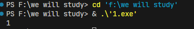
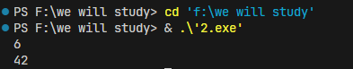

# 第三次作业

## 求主元素

第一题题目：求数组主元素递归算法的思想方法

**A**是具有 ***n***个元素的数组，***x***是 **A**中的一个元素，若**A**中有一半以上的元素与***x***相同，就称***x***是数组的主元素。例：数组**A={1,3,2,3,3,4,3}**中，元素**3**是该数组的主元素。

### 思路

既然主元素一定大于 `n/2` ，那么我数这个数出现次数一定大于其他所有数的和，我设置变量用来存储这个候选值，和计数器，如果计数器为0了，那么更新这个，如果和这候选值相同自增，不同就自减，为零就更新，更新之后我再算这个count，如果大于 `n/2`就直接将这个候选值作为最终结果

### 代码

```cpp
#include <bits/stdc++.h>
using namespace std;

template <typename Type>
bool candidate(Type A[], Type &c, int n, int m) {
    int count;//用以记录候选值出现的次数
    int j;
    bool b;
    if (m>=n) b = false;//递归结束条件,当m>=n时,返回FALSE,表示不存在候选值
    else {
        c = A[m];   
        j = m + 1;  
        count = 1;
        //以当前值为候选值,从m+1开始查找
        while (j<n && count>0) {
      
            if (A[j]==c) count ++;//如果A[j]等于候选值,则count加1
            else count --;//否则count减1
	          j = j + 1;//j加1
        }
        if (j==n && count==0) b = false;//到头了，还是0，返回FALSE
        else if (j==n && count>0) b = true;//到头了，不是0，返回TRUE
        else b = candidate(A,c,n,j);//递归调用，继续查找，直到找到候选值或者不存在候选值
}
    return b;
}
template <typename Type>
bool findresult(Type A[ ],Type &m,int n){
      int  count = 0;
      bool flag;
      flag=candidate(A,m,n,0);
      if(flag){
        for(int j=0;j<n;j++){
          if(A[j]==m){
            count++;
          }
        }
        if(count<=n/2){
          return false;
        }   
      }
    return flag;
}
int main() {
    int A[]={1,1,1,1,2,6};
    int m;
    if (findresult(A, m, 6)) {
        cout << m << endl;
    } else {
        cout << "no" << endl;
    }
    return 0;
}

```

### 运行结果



## 整数划分

将一个整数划分为多个整数相加的形式，并输出有所划分方法的数量。

（1）正整数n划分为若干正整数之和，最大加数不超过m的划分数（n划分最大加数不超过m）；

（2）正整数n划分为不超过m个正整数之和的划分数（n划分为m份）；

（3）正整数n划分为若干正奇整数之和的划分数；

（4）正整数n划分为互不相同正整数之和的划分数。

其中，整数划分无顺序，比如：对7划分，认为2 2 3和3 2 2和2 3 2为同一种划分。

### 代码

```cpp
#include <iostream>  
int q(int n,int m) {
    if ((n < 1) || (m < 1))
		return 0;
    if ((n == 1) || (m == 1))
		return 1;
    if (n < m)
		return q(n, n);
    if (n == m)
		return q(n, m - 1) + 1;
    return q(n, m - 1) + q(n - m, m);
}

int main() {  
    int n;  
    int sum=0;
    std::cin >> n;
    for(int m=n;m>0;m--) sum+=q(n,m);
    std::cout << sum << std::endl; 
    return 0;
}
```


