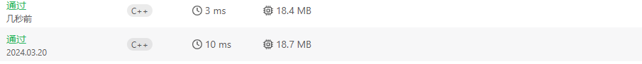
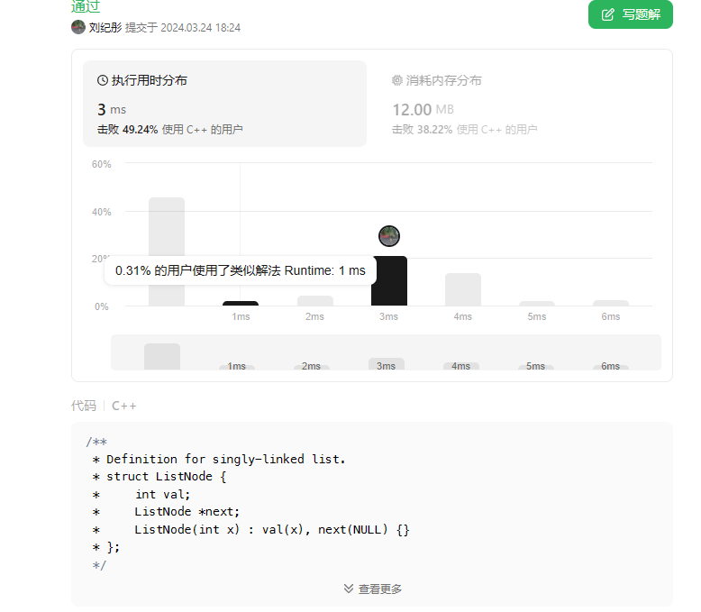
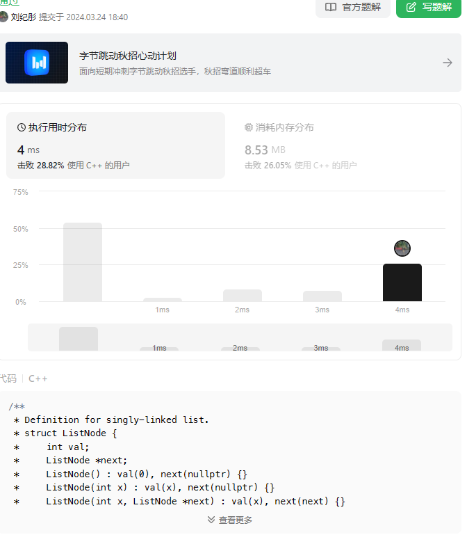

# 第四次作业

## 905：按奇偶排序数组

给你一个整数数组 nums，将 nums 中的的所有偶数元素移动到数组的前面，后跟所有奇数元素。

返回满足此条件的 任一数组 作为答案。

示例 1：

输入：nums = [3,1,2,4]
输出：[2,4,3,1]
解释：[4,2,3,1]、[2,4,1,3] 和 [4,2,1,3] 也会被视作正确答案。
示例 2：

输入：nums = [0]
输出：[0]

提示：

1 <= nums.length <= 5000
0 <= nums[i] <= 5000

### 思路

1：直接两次遍历就好

2：两个指针，奇数往左走，偶数往右走，遍历一次数组

### 代码

```cpp
//解法一
class Solution {
public:
    vector<int> sortArrayByParity(vector<int>& nums) {
        vector<int> a;
  for(int i=0;i<nums.size();i++)
  {
      if(nums[i]%2==1){
          a.push_back(nums[i]);
          nums.erase(nums.begin()+i);
  
          i--;
      }
  }
  nums.insert(nums.end(),a.begin(),a.end());
  return nums;
    }
};
```

```cpp
//解法二
class Solution{
public:
    vector<int> sortArrayByParity(vector<int>& nums)
    {
        vector<int> res(nums.size());
        int n=nums.size()-1;
        int i=0;
        for(auto num:nums)
        {
            if(num%2==0)
            {
                res[i]=num;
                i++;
            }
            else{
                res[n]=num;
                n--;
            }
        }
        return res;
    }
};
```

### 结果与分析



两次结果都分析出来都是要进行常数次的遍历,故时间复杂度为

$$
O(n)
$$

空间复杂度为

$$
O(1)
$$

## 链表倒数第k个元素

实现一种算法，找出单向链表中倒数第 k 个节点。返回该节点的值。

 **注意：** 本题相对原题稍作改动

**示例：**

<pre><strong>输入：</strong> 1->2->3->4->5 和 <em>k</em> = 2
<strong>输出： </strong>4</pre>

**说明：**

给定的 *k* 保证是有效的。

### 思路

1：快慢指针，快指针先走k步，然后快慢指针一起走，当快指针走到尾部时，慢指针就是倒数第k个元素

### 代码

```cpp
/**
 * Definition for singly-linked list.
 * struct ListNode {
 *     int val;
 *     ListNode *next;
 *     ListNode(int x) : val(x), next(NULL) {}
 * };
 */
class Solution {
public:
    int kthToLast(ListNode* head, int k) {
    ListNode *fast=head;
    ListNode *slow=head;
    for(int i=0;i<k;i++)
    {
        fast=fast->next;
    }
    while(fast)
    {
        fast=fast->next;
        slow=slow->next;
    }
    return slow->val;
    }
};
```

### 结果与分析



最终我们可以了解因为要对整个链表进行遍历，所以
时间复杂度为

$$
O(n)
$$

空间复杂度为

$$
O(1)
$$

## 链表的中间位置

给你单链表的头结点 `head` ，请你找出并返回链表的中间结点。

如果有两个中间结点，则返回第二个中间结点。

**示例 1：**


<pre><strong>输入：</strong>head = [1,2,3,4,5]
<strong>输出：</strong>[3,4,5]
<strong>解释：</strong>链表只有一个中间结点，值为 3 。
</pre>

**示例 2：**


<pre><strong>输入：</strong>head = [1,2,3,4,5,6]
<strong>输出：</strong>[4,5,6]
<strong>解释：</strong>该链表有两个中间结点，值分别为 3 和 4 ，返回第二个结点。
</pre>

**提示：**

* 链表的结点数范围是 `[1, 100]`
* `1 <= Node.val <= 100`

### 思路

思路就是快慢指针，涉及两个指针，一个一次性遍历两次，一个遍历一次，那么当快指针到头的时候就是这个值，对于leetcode上面题目来说，他的头节点就是指向了第一个元素，那么当fast指针的下一个为空的时候，这种情况下就是奇数个，返回中间的那个值，如果是偶数个，就是fast自身为空，此时slow的值也指向了第二个中间结点

### 代码

```cpp
/**
 * Definition for singly-linked list.
 * struct ListNode {
 *     int val;
 *     ListNode *next;
 *     ListNode() : val(0), next(nullptr) {}
 *     ListNode(int x) : val(x), next(nullptr) {}
 *     ListNode(int x, ListNode *next) : val(x), next(next) {}
 * };
 */
class Solution {
public:
    ListNode* middleNode(ListNode* head) {
        ListNode *fast=head;
        ListNode *slow=head;
        while(fast&&fast->next)
        {
            fast=fast->next->next;
            slow=slow->next;
        }
        return slow;
    }
};
```

### 结果与分析



最终我们可以了解因为要对整个链表进行遍历，所以
时间复杂度为
$$
O(n)
$$
空间复杂度为
$$
O(1)
$$
