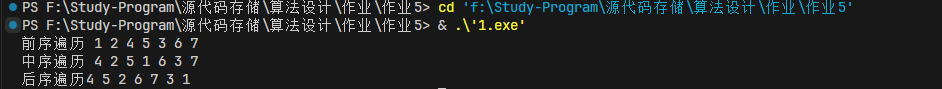

# 第五次作业

第一题二叉树的前中后序遍历非递归算法

## 思路

非递归我们主要通过栈来实现，对于前序遍历，我们先访问根节点，然后将右子树入栈，再将左子树入栈，对于中序遍历，我们先将左子树入栈，然后访问根节点，再将右子树入栈，对于后序遍历，我们先将左子树入栈，然后将右子树入栈，最后访问根节点。

## 源代码

```cpp
#include <iostream>
#include <stack>
using namespace std;

// 二叉树节点定义
struct TreeNode {
    int val;
    TreeNode* left;
    TreeNode* right;
    TreeNode(int x) : val(x), left(NULL), right(NULL) {}
};

// 非递归前序遍历
void preorderTraversal(TreeNode* root) {
    if (root == NULL) return;
    stack<TreeNode*> nodeStack;
    nodeStack.push(root);
    while (!nodeStack.empty()) {
        TreeNode* node = nodeStack.top();
        nodeStack.pop();
        cout << node->val << " ";
        if (node->right) nodeStack.push(node->right);
        if (node->left) nodeStack.push(node->left);
    }
}

// 非递归中序遍历
void inorderTraversal(TreeNode* root) {
    if (root == NULL) return;
    stack<TreeNode*> nodeStack;
    TreeNode* curr = root;
    while (curr != NULL || !nodeStack.empty()) {
        while (curr != NULL) {
            nodeStack.push(curr);
            curr = curr->left;
        }
        curr = nodeStack.top();
        nodeStack.pop();
        cout << curr->val << " ";
        curr = curr->right;
    }
}

// 非递归后序遍历
void postorderTraversal(TreeNode* root) {
    if (root == NULL) return;
    stack<TreeNode*> nodeStack1, nodeStack2;
    nodeStack1.push(root);
    while (!nodeStack1.empty()) {
        TreeNode* node = nodeStack1.top();
        nodeStack1.pop();
        nodeStack2.push(node);
        if (node->left) nodeStack1.push(node->left);
        if (node->right) nodeStack1.push(node->right);
    }
    while (!nodeStack2.empty()) {
        cout << nodeStack2.top()->val << " ";
        nodeStack2.pop();
    }
}

int main() {
    // 构造二叉树
    TreeNode* root = new TreeNode(1);
    root->left = new TreeNode(2);
    root->right = new TreeNode(3);
    root->left->left = new TreeNode(4);
    root->left->right = new TreeNode(5);

    // 前序遍历
    cout << "前序遍历 ";
    preorderTraversal(root);
    cout << endl;

    // 中序遍历
    cout << "中序遍历 ";
    inorderTraversal(root);
    cout << endl;

    // 后序遍历
    cout << "后序遍历";
    postorderTraversal(root);
    cout << endl;

    return 0;
}
```

## 结果



通过结果的分析我们可以看出，前序遍历，中序遍历，后序遍历的时间复杂度都是O(n)，空间复杂度都是O(n)。
