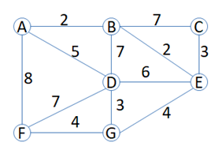
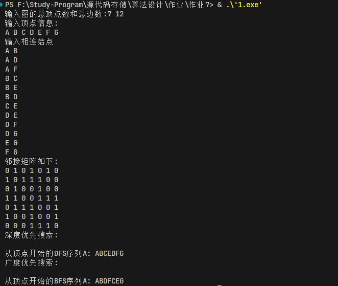
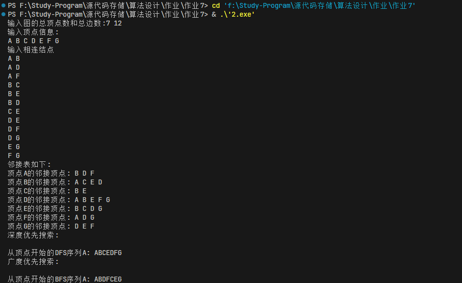

# 第七次作业

图的两种存储方式和遍历

## 思路（各模块设计）

1. 定义图的结构体，包括顶点数、边数、顶点信息和邻接矩阵（或邻接表）
2. 深度优先搜索
   1. 定义一个标记数组，标记顶点是否被访问过
   2. 从第一个顶点开始，遍历所有顶点，如果顶点未被访问过，则进行深度优先搜索
   3. 深度优先搜索函数
      1. 输出顶点信息
      2. 标记顶点已被访问
      3. 遍历所有顶点，如果顶点与当前顶点相邻且未被访问，则递归访问该顶点
3. 广度优先搜索
   1. 定义一个标记数组，标记顶点是否被访问过
   2. 从第一个顶点开始，遍历所有顶点，如果顶点未被访问过，则进行广度优先搜索
   3. 广度优先搜索函数
      1. 定义一个队列
      2. 输出顶点信息
      3. 标记顶点已被访问
      4. 将顶点入队
      5. 队列不为空时，取队首元素，出队，遍历所有顶点，如果顶点与当前顶点相邻且未被访问，则输出顶点信息，标记顶点已被访问，将顶点入队

对于邻接表和邻接矩阵，他俩仅在于表示方式中不同，邻接矩阵用的是0和1来表示这个节点是否可以进行遍历，而邻接表则用了一个数组，将与他相连的点放在这个数组中，代表他所相连，用来接下来的遍历。

## 代码

### 邻接矩阵法

```cpp
#include <iostream>
#include <queue>
#include <vector>
using namespace std;

const int MAXN = 100; //定义最大顶点数
const int INF = INT_MAX; //定义极大值

struct Graph {
    int vexnum, arcnum; //顶点数和边数
    char vexs[MAXN];//顶点信息
    int arcs[MAXN][MAXN];//邻接矩阵
};

//深度优先搜索
vector<bool> visited(MAXN, false);//标记顶点是否被访问过

void dfs(int i, Graph* g) {
    cout << g->vexs[i];//输出顶点信息
    visited[i] = true;//标记顶点i已被访问
    for (int j = 0; j < g->vexnum; j++) {//遍历所有顶点
        if (g->arcs[i][j] == 1 && !visited[j]) {//如果顶点i与顶点j相邻且顶点j未被访问
            dfs(j, g);//递归访问顶点j
        }
    }
}

void tdfs(Graph* g) {//深度优先搜索
    cout << "\n从顶点开始的DFS序列" << g->vexs[0] << ": ";
    for (int i = 0; i < g->vexnum; i++) {
        if (!visited[i]) {
            dfs(i, g);
        }
    }
}

//广度优先搜索
void bfs(int k, Graph* g) {
    queue<int> que;//定义队列
    cout << g->vexs[k];//输出顶点信息
    visited[k] = true;//标记顶点k已被访问
    que.push(k);//将顶点k入队
    while (!que.empty()) {//队列不为空
        int i = que.front();//取队首元素
        que.pop();//出队
        for (int j = 0; j < g->vexnum; j++) {//遍历所有顶点/
            if (g->arcs[i][j] == 1 && !visited[j]) {//如果顶点i与顶点j相邻且顶点j未被访问
                cout << g->vexs[j];//输出顶点信息
                visited[j] = true;//标记顶点j已被访问
                que.push(j);//将顶点j入队
            }
        }
    }
}

void tbfs(Graph* g) {//广度优先搜索
    cout << "\n从顶点开始的BFS序列" << g->vexs[0] << ": ";
    for (int i = 0; i < g->vexnum; i++) {
        if (!visited[i]) {
            bfs(i, g);
        }
    }

}

int main() {
    Graph g;
    cout << "输入图的总顶点数和总边数:";
    cin >> g.vexnum >> g.arcnum;//输入总顶点数和总边数
    cout << "输入顶点信息:\n";//输入顶点信息
    for (int i = 0; i < g.vexnum; i++) {//输入顶点信息
        cin >> g.vexs[i];//输入顶点信息
    }
    for (int i = 0; i < g.vexnum; i++) {//初始化
        for (int j = 0; j < g.vexnum; j++) {
            g.arcs[i][j] = 0;
        }
    }
    cout << "输入相连结点\n";
    for (int i = 0; i < g.arcnum; i++) {//构造邻接矩阵
        char v1, v2;//表示v1和v2相连接
        cin >> v1 >> v2;//输入相连结点
        int k = 0, l = 0;//找到v1和v2在图G中的位置
        while (g.vexs[k] != v1) {//找到v1在图G中的位置
            k++;
        }
        while (g.vexs[l] != v2) {//找到v2在图G中的位置
            l++;
        }
        g.arcs[k][l] = g.arcs[l][k] = 1;//构造邻接矩阵
    }
    cout << "邻接矩阵如下:\n";
    for (int i = 0; i < g.vexnum; i++) {//输出邻接矩阵
        for (int j = 0; j < g.vexnum; j++) {
            cout << g.arcs[i][j] << " ";
        }
        cout << endl;
    }
    cout << "深度优先搜索:\n";
    visited.assign(MAXN, false);//初始化
    tdfs(&g);//深度优先搜索
    cout << "\n广度优先搜索:\n";
    visited.assign(MAXN, false);
    tbfs(&g);
    return 0;
}
```

### 邻接表法

```cpp
#include <iostream>
#include <queue>
#include <vector>
using namespace std;

const int MAXN = 100; //定义最大顶点数
const int INF = INT_MAX; //定义极大值

struct Graph {
    int vexnum, arcnum; //顶点数和边数
    char vexs[MAXN];//顶点信息
    vector<vector<int>> adjList;//邻接表
};

//深度优先搜索
vector<bool> visited(MAXN, false);//标记顶点是否被访问过

void dfs(int i, Graph* g) {
    cout << g->vexs[i];//输出顶点信息
    visited[i] = true;//标记顶点i已被访问
    for (int j : g->adjList[i]) {//遍历顶点i的邻接顶点
        if (!visited[j]) {//如果顶点j未被访问
            dfs(j, g);//递归访问顶点j
        }
    }
}

void tdfs(Graph* g) {//深度优先搜索
    cout << "\n从顶点开始的DFS序列" << g->vexs[0] << ": ";
    for (int i = 0; i < g->vexnum; i++) {
        if (!visited[i]) {
            dfs(i, g);
        }
    }
}

//广度优先搜索
void bfs(int k, Graph* g) {
    queue<int> que;//定义队列
    cout << g->vexs[k];//输出顶点信息
    visited[k] = true;//标记顶点k已被访问
    que.push(k);//将顶点k入队
    while (!que.empty()) {//队列不为空
        int i = que.front();//取队首元素
        que.pop();//出队
        for (int j : g->adjList[i]) {//遍历顶点i的邻接顶点
            if (!visited[j]) {//如果顶点j未被访问
                cout << g->vexs[j];//输出顶点信息
                visited[j] = true;//标记顶点j已被访问
                que.push(j);//将顶点j入队
            }
        }
    }
}

void tbfs(Graph* g) {//广度优先搜索
    cout << "\n从顶点开始的BFS序列" << g->vexs[0] << ": ";
    for (int i = 0; i < g->vexnum; i++) {
        if (!visited[i]) {
            bfs(i, g);
        }
    }

}

int main() {
    Graph g;
    cout << "输入图的总顶点数和总边数:";
    cin >> g.vexnum >> g.arcnum;//输入总顶点数和总边数
    cout << "输入顶点信息:\n";//输入顶点信息
    for (int i = 0; i < g.vexnum; i++) {//输入顶点信息
        cin >> g.vexs[i];//输入顶点信息
    }
    g.adjList.resize(g.vexnum);//调整邻接表大小
    cout << "输入相连结点\n";
    for (int i = 0; i < g.arcnum; i++) {//构造邻接表
        char v1, v2;//表示v1和v2相连接
        cin >> v1 >> v2;//输入相连结点
        int k = 0, l = 0;//找到v1和v2在图G中的位置
        while (g.vexs[k] != v1) {//找到v1在图G中的位置
            k++;
        }
        while (g.vexs[l] != v2) {//找到v2在图G中的位置
            l++;
        }
        g.adjList[k].push_back(l);//将顶点v2加入顶点v1的邻接表中
        g.adjList[l].push_back(k);//将顶点v1加入顶点v2的邻接表中
    }
    cout << "邻接表如下:\n";
    for (int i = 0; i < g.vexnum; i++) {//输出邻接表
        cout << "顶点" << g.vexs[i] << "的邻接顶点: ";
        for (int j : g.adjList[i]) {
            cout << g.vexs[j] << " ";
        }
        cout << endl;
    }
    cout << "深度优先搜索:\n";
    visited.assign(MAXN, false);//初始化
    tdfs(&g);//深度优先搜索
    cout << "\n广度优先搜索:\n";
    visited.assign(MAXN, false);
    tbfs(&g);
    return 0;
}
```

## 输出结果

我使用可与实验4相同的图，去掉其权重的值，图如下所示



输出结果1(邻接矩阵法)：



输出正确

输出结果2(邻接表法)：



输出正确
