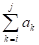
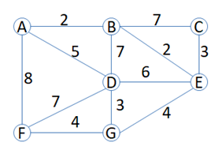

# 算法实验内容

本文如在中国大陆等相关地区有图片加载不出来，敬请使用特殊工具

实验1 递归算法实验

递归法是一种算法设计技术，它允许函数调用自身来解决问题。递归通常用于解决那些可以分解为更小的、相同类型的子问题的问题。递归算法通常简洁而直观，但需要谨慎设计以避免无限循环和栈溢出。

**一、实验目的**

1. 加深对递归算法的理解，包括递归的基本原理和递归调用的机制。
2. 学习如何设计和实现递归函数来解决具体问题。
3. 掌握递归算法的终止条件和递归步骤。
4. 分析递归算法的时间复杂度和空间复杂度。
5. 提高编程能力和问题解决能力。

**二、实验内容**

1. 用递归法实现插入排序。
2. 用递归法实现单链表的逆转。

实验2分治算法实验

分治法是一种递归算法设计技术，它将一个难以直接解决的大问题分解成若干个规模较小的相同问题来解决，然后将小问题的解合并以解决原来的大问题。分治法通常用于解决具有“最优子结构”的问题，即问题的最优解包含其子问题的最优解。

**一、实验目的**

1. 加深对分治法算法设计的理解，包括其基本原理和递归调用的机制。
2. 学习如何将大问题分解为小问题，并独立解决这些小问题。
3. 掌握分治法算法的三个步骤：分解、解决、合并。
4. 分析分治法算法的时间复杂度和空间复杂度。
5. 提高编程能力和复杂问题解决能力。

**二、实验内容**

用分治法实现一组无序序列的两路合并排序和快速排序。要求清楚合并排序及快速排序的基本原理，编程实现分别用这两种方法将输入（或者利用随机函数生成）的一组（不得少于50个数据）无序序列排序为有序序列后输出。

实验3 动态规划算法

动态规划法是一种在数学、管理科学、计算机科学、经济学和生物信息学中使用的，通过把原问题分解为相对简单的子问题的方式求解复杂问题的方法。动态规划经常被用于求解优化问题。

**一、实验目的**

1. 加深对动态规划法的理解，了解其基本思想和算法流程。
2. 学习如何在具体问题中应用动态规划法设计算法。
3. 分析动态规划法与分治法、回溯法的区别和联系，以及它们在不同类型问题中的适用性。
4. 提高算法设计能力和编程实践能力。
5. 掌握动态规划法的核心要素：最优子结构、边界条件、状态转移方程。

**二、实验内容**

给定由n个整数（可能为负整数）组成的序列a1,a2,…,an，求该序列形如：的子段和的最大值。当所有整数均为负数时定义其最大子段和为0。

分别采用穷举法、分治法、动态规划法完成。

实验4 贪心法实验

贪心法是一种在问题求解过程中，每一步都采取当前状态下最优（即最有利）的选择，从而希望导致最终全局最优解的算法设计方法。贪心法不能保证总能得到最优解，但在很多问题中，它能够得到高质量的解，并且算法效率较高。

**一、实验目的**

1. 加深对贪心法算法设计的理解，包括其基本原理和适用条件。
2. 学习如何在具体问题中应用贪心法设计算法。
3. 分析贪心法与动态规划法、回溯法的区别和联系，以及它们在不同类型问题中的适用性。
4. 提高算法设计能力和编程实践能力。
5. 掌握贪心法的核心要素：最优子结构、贪心选择性质、局部最优解转化为全局最优解。

**二、实验内容**

利用贪心算法思想，求无向图的最小生成树（分别完成Prim算法、Kruskal算法，其中，Kruskal算法要求使用并查集检查回路）。

假设给定的无向图如下：

实验5 回溯法实验

回溯法是一种通过探索问题的解空间树来寻找所有解的算法。它采用深度优先搜索的策略，从根节点开始，探索解空间树，当探索到某一节点时，如果该节点不满足问题的约束条件，则回溯；否则，继续探索该节点的子节点。回溯法适用于求解组合数较大的问题。

**一、实验目的**

1. 加深对回溯法的理解，了解其基本思想和算法流程。
2. 学习如何在具体问题中应用回溯法设计算法。
3. 分析回溯法与分支限界法的区别和联系，以及它们在不同类型问题中的适用性。
4. 提高算法设计能力和编程实践能力。

**二、实验内容**

1、假设某国家发行了n种不同面值的邮票，并且规定每张信封上最多只允许贴m张邮票。连续邮资问题要求对于给定的n和m，给出邮票面值的最佳设计，在1张信封上贴出从邮资1开始，增量为1的最大连续邮资区间。 例如当n=5，m=4时，面值为1，3，11，15，32的5种邮票可以贴出邮资的最大连续区间是1到70。

2、N后问题求解。

在进行实验时，可以选择一个或多个题目进行实践，通过编写代码、调试和优化。

实验6 分支限界法实验

分支限界法是一种在问题解空间树上搜索问题解的算法。它不同于回溯法的“深度优先”搜索，而是以“广度优先”或“最小耗费优先”的方式搜索解空间树。分支限界法在扩展节点处，先生成其所有的儿子节点（分支），然后再从当前的活节点（即扩展节点）中选取下一个扩展节点。为了有效地选择下一个扩展节点，加速搜索的进程，在每一个活节点处，计算一个函数值（限界），并根据这些函数值，从当前活节点表中选择一个最有利的节点作为扩展节点，使搜索朝着解空间上有最优解的分支推进，以便尽快地找出一个最优解。

**一、实验目的**

1. 加深对分支限界法的理解，了解其基本思想和算法流程。
2. 学习如何在具体问题中应用分支限界法设计算法。
3. 分析分支限界法与回溯法的区别和联系，以及它们在不同类型问题中的适用性。
4. 提高算法设计能力和编程实践能力。

**二、实验内容**

1. 实现基于分支限界法的0-1背包问题求解算法。
2. 使用分支限界法解决任务调度问题。
3. 应用分支限界法求解旅行商问题（TSP）。
4. 利用分支限界法解决最小生成树问题。
5. 设计并实现一个基于分支限界法的作业调度问题求解算法。

在进行实验时，可以选择一个或多个题目进行实践，通过编写代码、调试和优化。
