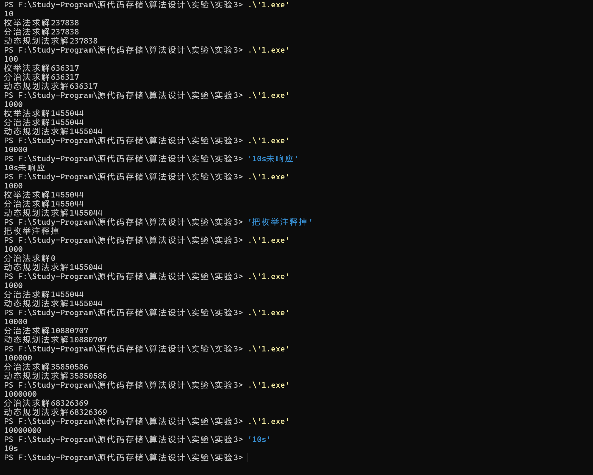

# disan

思路：
分治法：将数组分为两部分，分别求左右两部分的最大子段和，再求跨越中间的最大子段和，三者取最大值。之后递归求解。
动态规划法：设dp[i]为以a[i]结尾的最大子段和，dp[i]=max(dp[i-1]+a[i],a[i])，最后取dp数组中的最大值即可。
枚举法：枚举所有的子段，求出最大值。

```cpp
#include<bits/stdc++.h>
//给定由n个整数（可能为负整数）组成的序列a1,a2,…,an，求该序列形如： 的子段和的最大值。当所有整数均为负数时定义其最大子段和为0。
using namespace std;
//枚举法求解
int max_subarray_0(vector<int> a){
    int n=a.size();
    int max_sum=0;
    for(int i=0;i<n;i++){
        for(int j=i;j<n;j++){
            int sum=0;
            for(int k=i;k<=j;k++){
                sum+=a[k];
            }
            max_sum=max(max_sum,sum);
        }
    }
    return max_sum;
}
//分治法求解
int max_subarray_1(vector<int>a)
{
    int n=a.size();
    if(n==1){
        return max(0,a[0]);
    }
    vector<int> a1(a.begin(),a.begin()+n/2);
    vector<int> a2(a.begin()+n/2,a.end());
    int sum1=max_subarray_1(a1);
    int sum2=max_subarray_1(a2);
    int sum3=0;
    int sum4=0;
    int sum=0;
    for(int i=n/2-1;i>=0;i--){
        sum+=a[i];
        sum3=max(sum3,sum);
    }
    sum=0;
    for(int i=n/2;i<n;i++){
        sum+=a[i];
        sum4=max(sum4,sum);
    }
    return max(max(sum1,sum2),sum3+sum4);
}
//动态规划法
int max_subarray_2(vector<int>a)
{
        int pre=0;
        int ans=a[0];
        for(int &X:a)
        {
            pre=max(pre+X,X);
            ans=max(pre,ans);
        }
        return ans;
}
int main(){
    int n;
    cin>>n;
    vector<int> a(n);
    //调用随机数生成数组(区间在-1e5~1e5之间)
    for(int i=0;i<n;i++){
        a[i]=(1.0*rand()/(RAND_MAX + 1))*200001-100000;
        }
        // //输出数组
        // for(int i=0;i<n;i++){
        //     cout<<a[i]<<" ";
        // }
        // cout<<endl;
    int max_sum=0;
    max_sum=max_subarray_0(a);
    cout<<"枚举法求解";
    cout<<max_sum<<endl;
    max_sum=0;
     max_sum=max_subarray_1(a);
    cout<<"分治法求解";
    cout<<max_sum<<endl;
    max_sum=0;
    max_sum=max_subarray_2(a);
    cout<<"动态规划法求解";
    cout<<max_sum<<endl;
    return 0;


}
```


