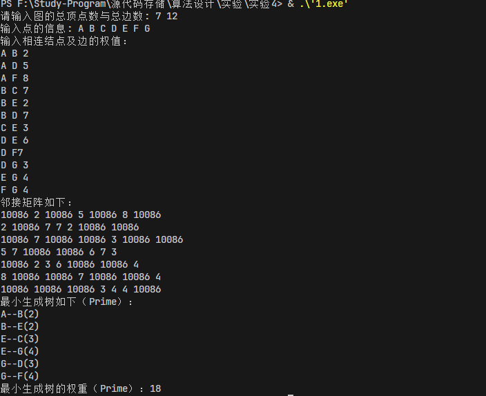
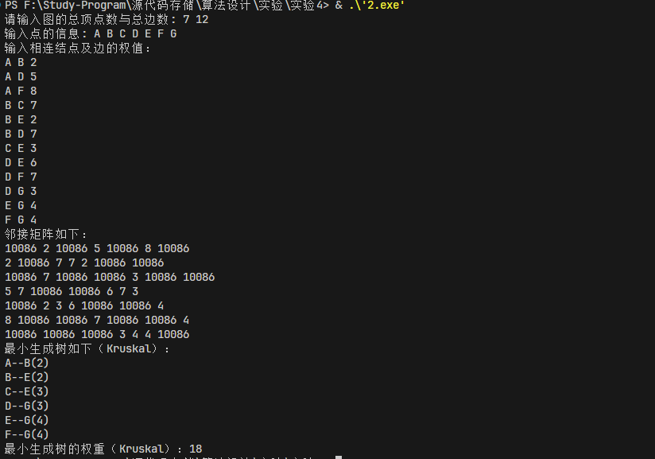

# 4

## 算法设计思路

prim算法是一种求解最小生成树的算法，它的基本思想是：从一个顶点出发，选择与该顶点相连的最小权值的边，然后再选择与这两个顶点相连的最小权值的边，以此类推，直到所有的顶点都被加入到最小生成树中。其实现步骤如下：

1. 从图中任意一个顶点出发，将该顶点加入到最小生成树中；
2. 从与最小生成树中的顶点相连的边中选择权值最小的边，将该边的另一个顶点加入到最小生成树中；
3. 重复步骤2，直到所有的顶点都被加入到最小生成树中。

Krusual 算法和 Prim 算法都是求解最小生成树的算法，但是它们的实现思路不同。Krusual 算法是从边的角度出发，每次选择权值最小的边，而 Prim 算法是从顶点的角度出发，每次选择与最小生成树中的顶点相连的最小权值的边。其实现步骤如下：

1. 从图中任意一个顶点出发，将该顶点加入到最小生成树中；
2. 从与最小生成树中的顶点相连的边中选择权值最小的边，将该边的另一个顶点加入到最小生成树中；
3. 重复步骤2，直到所有的顶点都被加入到最小生成树中。

prim算法的算法代码：

```cpp
#include<bits/stdc++.h>
using namespace std;
const int MAXN = 100; // 最大顶点数
const int INF = INT_MAX; // 极大值
typedef struct Mgraph
{
    char vexs[MAXN]; // 顶点表
    int arcs[MAXN][MAXN]; // 邻接矩阵
    int vexnum; // 图的当前点数
    int arcnum; // 图的当前边数
}AMGraph; // 邻接矩阵表示图
// Prime算法的边
struct edge
{
    char adjvex; // 最小边在U中的那个顶点
    int mincost; // 最小边上的权值
}closedge[MAXN]; // 辅助数组
int LocateVex(AMGraph* G, char v) // 找到结点V在图G中的位置 即下标
{
    for (int i = 0; i < G->vexnum; i++)//查找v在图G中的位置
    {
        if (G->vexs[i] == v)
        return i;
    }
    cout << "没找到" << endl;
    return 0;
}
void CreatAMG(AMGraph* G)//邻接矩阵表示法创建无向网
{
    cout << "请输入图的总顶点数与总边数: ";
    cin >> G->vexnum >> G->arcnum;//输入总顶点数 总边数
    cout << "输入点的信息: ";
    for (int i = 0; i < G->vexnum; i++)//输入顶点信息
    cin >> G->vexs[i];//输入顶点信息
    for (int i = 0; i < G->vexnum; i++)//初始化
    for (int j = 0; j < G->vexnum; j++)//初始化
    G->arcs[i][j] = INF;//初始化
    char v1, v2; // 相连结点
    int w; // 权值
    cout << "输入相连结点及边的权值：" << endl;
    for (int k = 0; k < G->arcnum; k++)//构造邻接矩阵
    {
        cin >> v1 >> v2 >> w; // 表示v1和v2相连接
        int i = LocateVex(G, v1);//找到v1在图G中的位置
        int j = LocateVex(G, v2);//找到v2在图G中的位置
        G->arcs[i][j] = G->arcs[j][i] = w;//构造邻接矩阵
        closedge[k].adjvex = v1;//初始化
        closedge[k].mincost = w;//初始化
    }
    cout << "邻接矩阵如下：" << endl;
    for (int i = 0; i < G->vexnum; i++)
    {
        for (int j = 0; j < G->vexnum; j++)//输出邻接矩阵
        cout << G->arcs[i][j] << " ";
        cout << "\n";
    }
    return;
}
// 求G图中的最小边以及该边两个顶点中不在U中的那个顶点的下标
int Min(struct edge* closedge, AMGraph* G)
{
    int min = INF;//初始化
    int ret = -1;
    for (int i = 0; i < G->vexnum; i++)//找到最小边
    {
    if (closedge[i].mincost != 0 && min > closedge[i].mincost)//找到最小边
    {
        min = closedge[i].mincost;//
        ret = i;
    }
    }
    return ret;
}
void miniSpanTree_Prime(AMGraph* G, char u)
{
    /*
    * closedge[i].mincost == 0 说明i对应的顶点被加入U
    */
    int k = LocateVex(G, u); // 寻找顶点u在G中的位置（vexs中的下标）
    for (int i = 0; i < G->vexnum; i++)
    {
        if (i != k)
        {
        closedge[i] = { u,G->arcs[k][i] }; // 到达下标为i的这个点的边
        }
    }
    closedge[k].mincost = 0;//初始化 U={u}
    int totalCost = 0; // 记录最小生成树的总权重
    cout << "最小生成树如下（Prime）：" << endl;
    for (int i = 1; i < G->vexnum; i++)//生成最小生成树
    {
        k = Min(closedge, G);//找到最小边
        char u0 = closedge[k].adjvex;//找到最小边的顶点
        char v0 = G->vexs[k];//找到最小边的顶点
        totalCost += closedge[k].mincost;//更新最小生成树的权重
        cout << u0 << "--" << v0 << "(" << closedge[k].mincost << ")" << endl;//输出最小生成树
        closedge[k].mincost = 0;//将顶点k加入U
    for (int j = 0; j < G->vexnum; j++)//更新closedge数组
    {
        if (G->arcs[k][j] < closedge[j].mincost)//更新closedge数组
        closedge[j] = { G->vexs[k],G->arcs[k][j] };
    }
    }
    cout << "最小生成树的权重（Prime）：" << totalCost << endl;
}
int main()
{
    AMGraph G;
    CreatAMG(&G);
    miniSpanTree_Prime(&G, 'A');
    return 0;
}
```



Kruskal算法如下:

```cpp
#include<bits/stdc++.h>
using namespace std;
const int MAXN = 100; // 最大顶点数
const int INF = 10086; // 极大值
typedef struct Mgraph
{
    char vexs[MAXN]; // 顶点表
    int arcs[MAXN][MAXN]; // 邻接矩阵
    int vexnum; // 图的当前点数
    int arcnum; // 图的当前边数
}AMGraph; // 邻接矩阵表示图
// Kruskal算法的边
struct Edge
{
    char head;//最小边在U中的那个顶点
    char tail;//最小边上的权值
    int weight;
}edge[MAXN];//辅助数组
int LocateVex(AMGraph* G, char v) // 找到结点V在图G中的位置 即下标
{
    for (int i = 0; i < G->vexnum; i++)//查找v在图G中的位置
    {
        if (G->vexs[i] == v)
        return i;
    }
    cout << "没找到" << endl;
    return 0;
}
void CreatAMG(AMGraph* G)//邻接矩阵表示法创建无向网
{
    cout << "请输入图的总顶点数与总边数: ";//输入总顶点数 总边数
    cin >> G->vexnum >> G->arcnum;//输入总顶点数 总边数
    cout << "输入点的信息: ";//输入顶点信息
    for (int i = 0; i < G->vexnum; i++)//输入顶点信息
        cin >> G->vexs[i];
    for (int i = 0; i < G->vexnum; i++)//初始化
    for (int j = 0; j < G->vexnum; j++)
        G->arcs[i][j] = INF;
    char v1, v2; // 相连结点
    int w; // 权值
    cout << "输入相连结点及边的权值：" << endl;
    for (int k = 0; k < G->arcnum; k++)//构造邻接矩阵
    {
        cin >> v1 >> v2 >> w; // 表示v1和v2相连接
        edge[k] = { v1,v2,w };
        int i = LocateVex(G, v1);//找到v1在图G中的位置
        int j = LocateVex(G, v2);//找到v2在图G中的位置
        G->arcs[i][j] = G->arcs[j][i] = w;
    }
    cout << "邻接矩阵如下：" << endl;//输出邻接矩阵
    for (int i = 0; i < G->vexnum; i++)//输出邻接矩阵
    {
    for (int j = 0; j < G->vexnum; j++)
        cout << G->arcs[i][j] << " ";//输出邻接矩阵
        cout << "\n";
    }
    return;
}
// Kruskal算法
int parent[MAXN]; // 并查集数组
// 查找根节点
int find(int x)
{
    if (parent[x] != x)
    {
    parent[x] = find(parent[x]); // 路径压缩
    }
    return parent[x];
}
// 合并两个集合
void unionSets(int x, int y)
{
    int rootX = find(x);//查找根节点
    int rootY = find(y);//查找根节点
    if (rootX != rootY)
    {
    parent[rootX] = rootY;
    }
}
bool cmp(struct Edge a, struct Edge b)
{
    return a.weight < b.weight;
}
void miniSpanTree_Krusal(AMGraph* G, char u)
{
    sort(edge, edge + G->arcnum, cmp); // 按权重排序边
// 初始化并查集
    for (int i = 0; i < G->vexnum; i++)//初始化并查集
    {
        parent[i] = i;
    }
    cout << "最小生成树如下（Kruskal）：" << endl;
    int count = 0; // 记录已加入最小生成树的边的数量
    int totalCost = 0; // 记录最小生成树的总权重
    for (const auto& edg : edge)
    {
        int v1 = LocateVex(G, edg.head);
        int v2 = LocateVex(G, edg.tail);
        // 检查是否形成回路
        if (find(v1) != find(v2))
        {
            unionSets(v1, v2); // 合并集合
            count++;
            totalCost += edg.weight;
            cout << edg.head << "--" << edg.tail << "(" << edg.weight << ")" << endl; // 输出此边
            if (count == G->vexnum - 1) break; // 最小生成树已经形成
        }
    }
    if (count < G->vexnum - 1)
    cout << "图不是连通图，没有最小生成树" << endl;
    else
    cout << "最小生成树的权重（Kruskal）：" << totalCost << endl;
}
int main()
{
    AMGraph G;
    CreatAMG(&G);
    miniSpanTree_Krusal(&G, 'A');
    return 0;
}
```



### 算法复杂度分析

prim算法的时间复杂度为O(n^2)，空间复杂度为O(n)。Kruskal算法的时间复杂度为O(nlogn)，空间复杂度为O(n)。

### 实验总结

这两个算法都是求解最小生成树的算法，但是它们的实现思路不同。Kruskal算法是从边的角度出发，每次选择权值最小的边，而Prim算法是从顶点的角度出发，每次选择与最小生成树中的顶点相连的最小权值的边。这两个算法都是求解最小生成树的算法，但是它们的实现思路不同。Kruskal算法是从边的角度出发，每次选择权值最小的边，而Prim算法是从顶点的角度出发，每次选择与最小生成树中的顶点相连的最小权值的边。其不同角度也代表着不同的实现思路，因此在实际应用中，需要根据具体的问题选择合适的算法。
