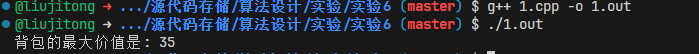

# 实验6

首先，需要明确0-1背包问题的定义：给定一个背包，其最大承重量为W，以及n个物品，每个物品都有自己的重量wi和价值vi。目标是在不超过背包承重量的前提下，选择某些物品放入背包，使得背包内物品的总价值最大。

通过分支限界法的解题思路如下：

1. 定义节点结构体，用于存储背包问题的状态。节点包含以下信息：
   - 当前处理的物品编号level
   - 当前已装入背包的重量currentWeight
   - 当前已装入背包的价值currentValue
   - 是否选择了某个物品taken

2. 初始化优先队列，根节点表示初始状态。根节点的上界为0。
   - 优先队列按照节点的上界从大到小排序，每次取出上界最大的节点进行扩展。
   - 如果当前节点的上界小于当前最优解，则不再扩展该节点。

3. 对于每个节点，有两种选择：
    - 不选择当前物品：将当前物品的taken标记为false，继续扩展下一个节点。
    - 选择当前物品：如果不超过重量限制，则将当前物品的taken标记为true，继续扩展下一个节点。

4. 当处理完所有物品时，更新最优解。

5. 重复步骤2-4，直到优先队列为空。

下面是使用C++实现的0-1背包问题的分支限界法求解代码：


```cpp
#include <algorithm>
#include <iostream>
#include <limits>
#include <queue>
#include <vector>
using namespace std;
// 物品结构体
struct Item {
    int weight; // 重量
    int value;  // 价值
};
vector<Item> items = {{2, 12}, {1, 10}, {3, 20}, {2, 15},{1, 5}};
int nItems = items.size();
int maxWeight = 5;
// 节点结构体，用于存储背包问题的状态
struct Node {
    int level;          // 当前处理的物品编号
    int currentWeight;  // 当前已装入背包的重量
    int currentValue;   // 当前已装入背包的价值
    vector<bool> taken; // 是否选择了某个物品
    // 构造函数
    Node(int l, int cw, int cv, const vector<bool>& t)
        : level(l), currentWeight(cw), currentValue(cv), taken(t) {}
    // 计算当前节点的上界
    int upperBound() const {
        int remainingWeight = maxWeight - currentWeight;
        int remainingValue = 0;
        for (int i = level; i < nItems; ++i) {
            if (remainingWeight >= items[i].weight) {
                remainingValue += items[i].value;
                remainingWeight -= items[i].weight;
            } else {
                remainingValue +=
                    items[i].value * (remainingWeight / items[i].weight);
                break;
            }
        }
        return currentValue + remainingValue;
    }
    // 比较函数，用于优先队列
    bool operator<(const Node& other) const {
        return upperBound() < other.upperBound();
    }
};
// 分支限界法求解0-1背包问题
int knapsack(const vector<Item>& items, int maxWeight) {
    int nItems = items.size();
    vector<bool> taken(nItems, false); // 初始化所有物品都未选择
    // 初始化优先队列，根节点表示初始状态
    priority_queue<Node> pq;
    pq.push(Node(0, 0, 0, taken));
    // 初始化当前最优解
    int bestValue = 0;
    while (pq.size()) {
        Node current = pq.top();
        pq.pop();
        // 如果已经处理完所有物品，更新最优解
        if (current.level == nItems) {
            bestValue = max(bestValue, current.currentValue);
            continue;
        }
        // 不选择当前物品
        vector<bool> notTaken = current.taken;
        notTaken[current.level] = false;
        pq.push(Node(current.level + 1, current.currentWeight,
                     current.currentValue, notTaken));
        // 选择当前物品（如果不超过重量限制）
        if (current.currentWeight + items[current.level].weight <= maxWeight) {
            vector<bool> taken = current.taken;
            taken[current.level] = true;
            pq.push(Node(current.level + 1,
                         current.currentWeight + items[current.level].weight,
                         current.currentValue + items[current.level].value,
                         taken));
        }
        // 剪枝：如果当前节点的上界小于最优解，则不再扩展该节点
        if (current.upperBound() < bestValue) {
            break;
        }
    }
    return bestValue;
}
int main() {
    // 求解并输出结果
    int bestValue = knapsack(items, maxWeight);
    cout << "背包的最大价值是: " << bestValue << endl;
    return 0;
}
```


