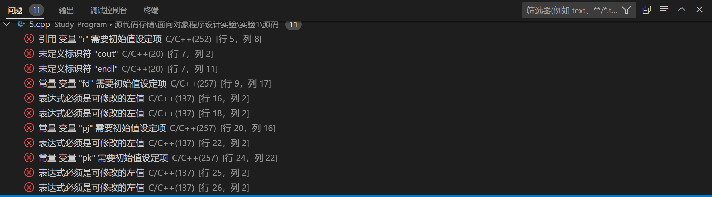

# 第五题

```C++
#include <iostream>
int main()
{	//引用
	int i;
	int &r;//r引用i
	r=100;
	cout<<i<<endl;
	//命名常量
	const double fd;
	cout<<fd<<endl;
	//指向常量的指针
	int a=1,b=2;
	const int c=3;
	const int * pi;
	pi=&a;
	*pi=10;
	pi=&c;
	c=100;
	//常指针
	int * const pj;//pj指向a
	*pj=200;
	pj=&b;
	//指向常量的常指针
	const int * const pk;//pk指向b
	pk=&c;
	*pk=300;
	cout<<"a="<<a<<"b="<<b<<"c="<<c<<endl;
  return 0;
}

```

报错结果：


- 第一件事就是没有定义命名空间，否则cin,cout,endl,这些是一定会报错的。

- 引用没有初始化。

- 常量没有初始化。

- 指向常量的指针(`const int * pi`)，其指向的内容不可修改。

- 常量一旦初始化，不可被改变(`const int c=3`)。

- 常指针的地址不可被改变(`int *const pj=&a`)。

- 指向常量的常指针无论是什么，都不可以被改变(`const int * const pk=&b`)。